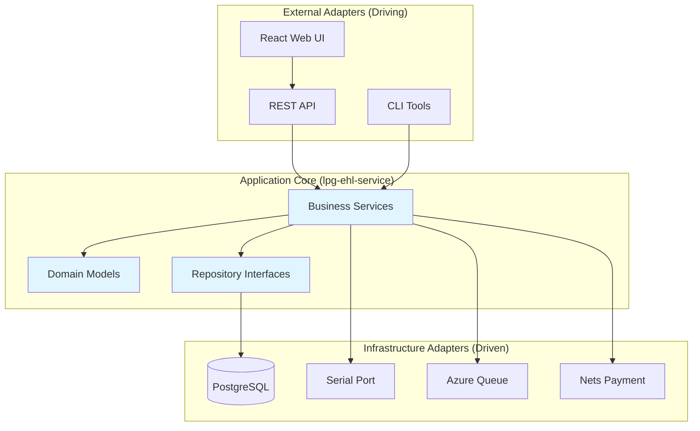
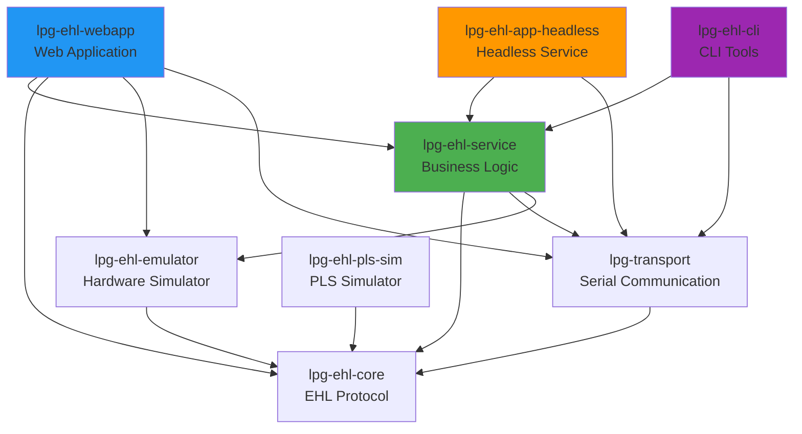
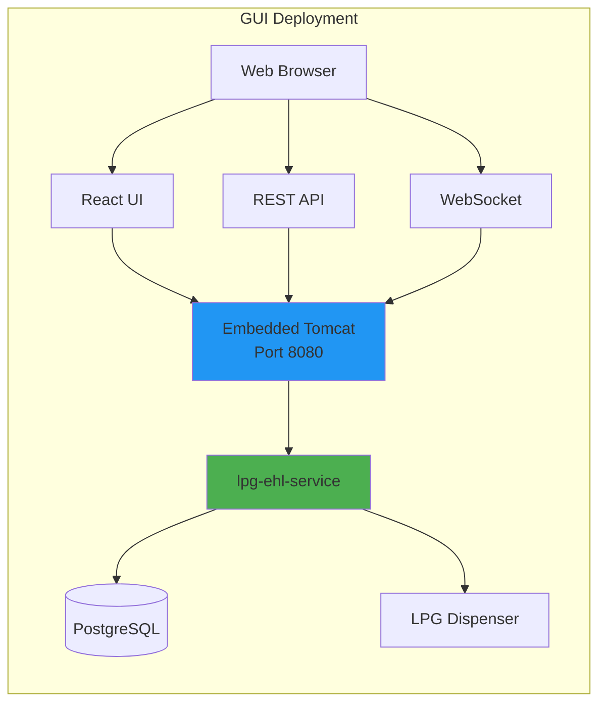
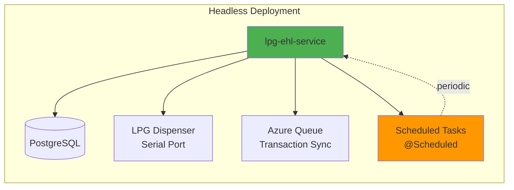
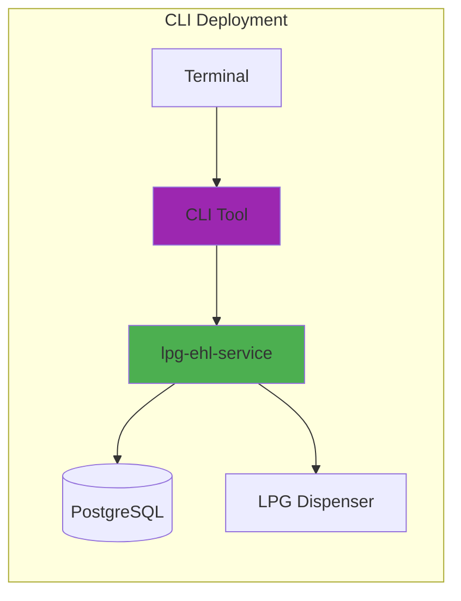
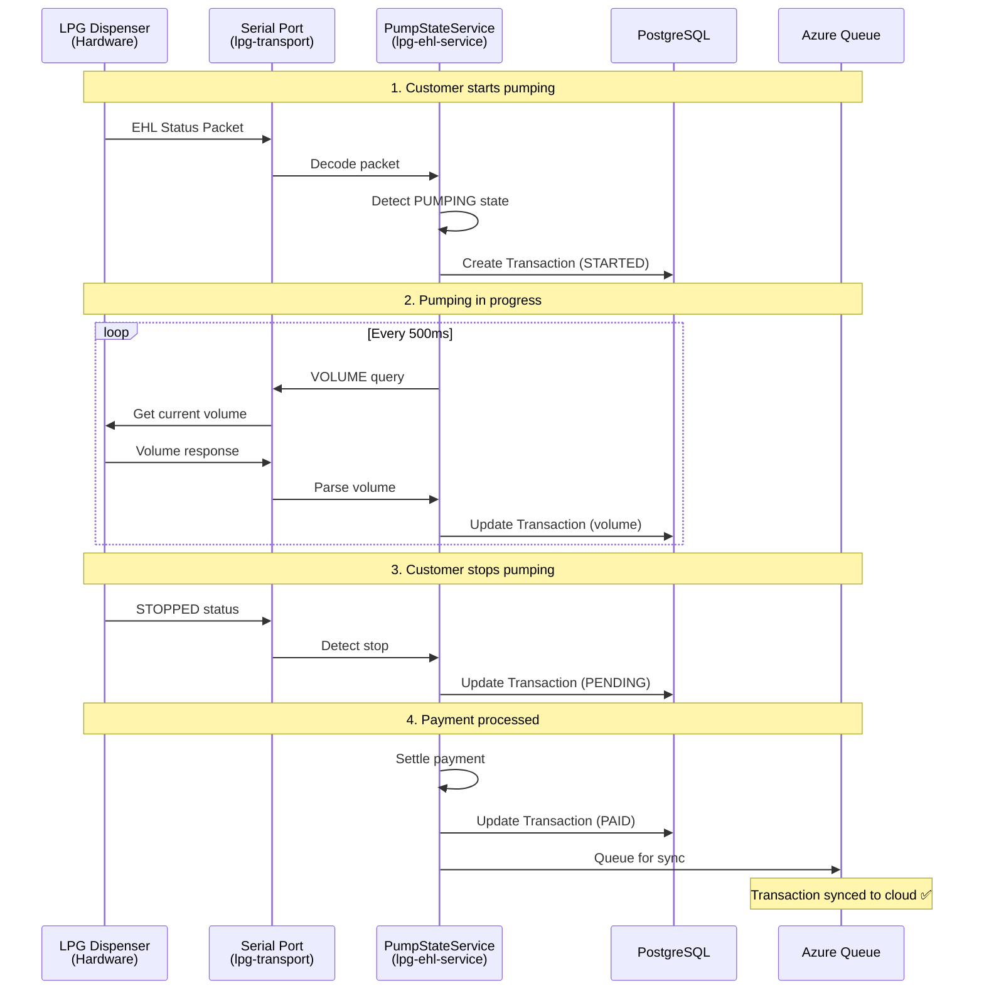
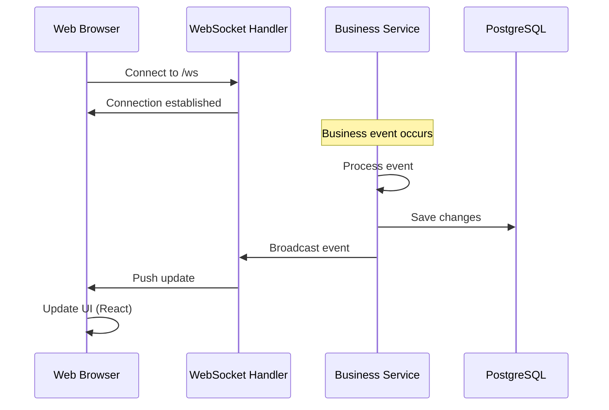

# LPG EHL System Architecture

**Version:** 1.0  
**Date:** January 2026  
**Status:** Active

## Table of Contents
1. [Overview](#overview)
2. [Hexagonal Architecture](#hexagonal-architecture)
3. [Module Structure](#module-structure)
4. [Deployment Modes](#deployment-modes)
5. [Technology Stack](#technology-stack)
6. [Data Flow](#data-flow)
7. [Configuration](#configuration)
8. [Build and Deployment](#build-and-deployment)

---

## Overview

LPG EHL er et fleksibelt system for styring og overvåking av LPG-dispensere (flytende petroleumsgass pumper). Systemet bruker **hexagonal architecture** (ports and adapters) for å separere forretningslogikk fra infrastruktur, noe som muliggjør tre distinkte kjøremiljøer fra samme kodebase:

- **🖥️ GUI Mode** - Full web-applikasjon med React frontend
- **🤖 Headless Mode** - Bakgrunnsservice uten UI
- **⚡ CLI Mode** - Kommandolinje-verktøy for administrasjon

### Key Features

- ✅ **EHL Protocol Support** - Kommunikasjon med Wayne EHL-dispensere
- ✅ **Dual Mode** - LAB mode (emulator) og FIELD mode (ekte hardware)
- ✅ **Database Persistence** - PostgreSQL med Liquibase migrations
- ✅ **Azure Integration** - Skysynkronisering av transaksjoner
- ✅ **Real-time Updates** - WebSocket for live oppdateringer
- ✅ **Payment Integration** - Nets Cloud Connect for kortbetalinger
- ✅ **Credit Account Management** - Kundekreditt og fakturering

---

## Hexagonal Architecture

Systemet følger hexagonal architecture-prinsipper for å separere forretningslogikk fra infrastruktur:



### Architectural Layers

| Layer | Description | Location |
|-------|-------------|----------|
| **Presentation** | Web controllers, WebSocket handlers, CLI commands | `lpg-ehl-webapp`, `lpg-ehl-cli` |
| **Application** | Business services, use cases, orchestration | `lpg-ehl-service` |
| **Domain** | Entities, value objects, domain logic | `lpg-ehl-service/model` |
| **Infrastructure** | Database, hardware, external APIs | `lpg-ehl-service/repository`, `lpg-ehl-transport`, `lpg-ehl-core` |

---

## Module Structure

### Complete Module Dependency Graph



### Module Descriptions

#### 1. **lpg-ehl-service** 🎯
**Purpose:** Business logic core - shared av alle deployment modes

**Contents:**
```
lpg-ehl-service/
├── model/                  # JPA entities (Transaction, Customer, etc.)
├── repository/             # Spring Data repositories
├── service/                # Business services
│   ├── DispenserService
│   ├── TransactionService
│   ├── PumpStateService
│   ├── AzureSyncService
│   └── ...
├── integration/            # External integrations
│   └── NetsCloudSocketClient
├── payment/                # Payment logic
├── credit/                 # Credit management
├── dto/                    # Data Transfer Objects
└── event/                  # Event publisher interface (hexagonal port)
```

**Dependencies:**
- Spring Boot (Data JPA, Integration, WebSocket)
- PostgreSQL Driver
- Azure Storage Queue SDK
- lpg-ehl-core
- lpg-transport

#### 2. **lpg-ehl-webapp** 🖥️
**Purpose:** Web-applikasjon med REST API og React frontend

**Contents:**
```
lpg-ehl-webapp/
├── controller/             # REST controllers
├── websocket/              # WebSocket adapters (driving adapters)
├── config/                 # Spring Security, CORS, etc.
├── credit/                 # Credit controller
├── payment/                # Payment controller
└── resources/
    ├── static/             # React build output
    └── db/changelog/       # Liquibase migrations
```

**Port:** 8080 (default)  
**Access:** http://localhost:8080

#### 3. **lpg-ehl-app-headless** 🤖
**Purpose:** Bakgrunnsservice for produksjon uten GUI

**Contents:**
```
lpg-ehl-app-headless/
└── headless/
    ├── HeadlessApplication.kt      # Main application
    └── HeadlessStartupRunner.kt    # Startup logic
```

**Use Cases:**
- Produksjonsmiljø på bensinstasjon
- Docker containers
- Systemd services
- Raspberry Pi deployment

#### 4. **lpg-ehl-cli** ⚡
**Purpose:** Kommandolinje-verktøy for administrasjon

**Use Cases:**
- Database migrations
- Batch operations
- System diagnostics
- Testing and debugging

#### 5. **lpg-ehl-core** 🔧
**Purpose:** EHL protocol implementation og kommunikasjon

**Contents:**
- EHL packet encoding/decoding
- Command definitions
- Protocol state machine
- EhlCommunicator abstraction

#### 6. **lpg-transport** 📡
**Purpose:** Serial port kommunikasjon (FIELD mode)

**Contents:**
- SerialPortIO implementation
- jSerialComm integration
- RS-485 hardware interface

#### 7. **lpg-ehl-emulator** 🧪
**Purpose:** Hardware simulator for LAB mode

**Contents:**
- In-memory dispenser simulation
- Virtual serial port
- Testing infrastructure

---

## Deployment Modes

### 1. GUI Mode (Web Application) 🖥️



**JAR File:** `lpg-ehl-webapp-0.0.1-SNAPSHOT.jar`

**Startup:**
```bash
java -jar lpg-ehl-webapp.jar \
  --spring.profiles.active=production \
  --DB_HOST=postgres.example.com \
  --DB_USER=lpg_user \
  --DB_PASSWORD=<secret>
```

**Features:**
- ✅ Full web UI (React Control Panel)
- ✅ REST API med Swagger documentation
- ✅ WebSocket for real-time updates
- ✅ Actuator endpoints for monitoring
- ✅ All business logic fra lpg-ehl-service

**Access Points:**
- Frontend: http://localhost:8080
- API: http://localhost:8080/api/v1/*
- Swagger: http://localhost:8080/swagger-ui.html
- Actuator: http://localhost:8080/actuator/*

---

### 2. Headless Mode (Background Service) 🤖



**JAR File:** `lpg-ehl-app-headless-0.0.1-SNAPSHOT.jar`

**Startup:**
```bash
# Produksjon (FIELD mode - ekte hardware)
java -jar lpg-ehl-app-headless.jar \
  --EHL_EMULATOR_ENABLED=false \
  --EHL_SERIAL_PORT=/dev/ttyS0 \
  --DB_HOST=localhost \
  --AZURE_ENABLED=true

# Testing (LAB mode - emulator)
java -jar lpg-ehl-app-headless.jar \
  --EHL_EMULATOR_ENABLED=true
```

**Features:**
- ✅ **NO WEB SERVER** - Zero HTTP overhead
- ✅ Automatic hardware initialization
- ✅ Scheduled tasks (@Scheduled annotations)
- ✅ Database persistence
- ✅ Azure cloud sync
- ✅ Hardware watchdog
- ✅ Transaction logging

**Perfect For:**
- 🏭 Production deployment på bensinstasjoner
- 🐳 Docker containers
- 🐧 Linux systemd services
- 🥧 Raspberry Pi
- ☁️ Cloud VM instances

**Systemd Service Example:**
```ini
[Unit]
Description=LPG EHL Headless Service
After=network.target postgresql.service

[Service]
Type=simple
User=lpg
WorkingDirectory=/opt/lpg-ehl
ExecStart=/usr/bin/java -jar /opt/lpg-ehl/lpg-ehl-app-headless.jar
Restart=on-failure
RestartSec=10s

Environment="DB_HOST=localhost"
Environment="EHL_EMULATOR_ENABLED=false"
Environment="EHL_SERIAL_PORT=/dev/ttyUSB0"
Environment="AZURE_ENABLED=true"

[Install]
WantedBy=multi-user.target
```

**Logging:**
- Console output for systemd/Docker
- File logging: `/var/log/lpg-ehl/headless.log` (configurable)
- Log rotation built-in (30 days, 10MB per file)

---

### 3. CLI Mode (Command Line Tools) ⚡



**JAR File:** `lpg-ehl-cli-0.0.1-SNAPSHOT.jar`

**Use Cases:**

```bash
# Database migrations
java -jar lpg-ehl-cli.jar migrate --target-version=1.5.0

# Batch operations
java -jar lpg-ehl-cli.jar transactions export \
  --from=2026-01-01 \
  --to=2026-01-31 \
  --format=csv

# System diagnostics
java -jar lpg-ehl-cli.jar diagnostics \
  --check-hardware \
  --check-database \
  --check-azure

# Price updates
java -jar lpg-ehl-cli.jar price set --product=LPG --price=16.50

# Testing
java -jar lpg-ehl-cli.jar test dispenser \
  --address=1 \
  --command=STATUS
```

**Features:**
- ✅ Non-interactive execution
- ✅ Exit codes for scripting
- ✅ JSON/CSV output formats
- ✅ Piping support
- ✅ Batch processing

---

## Technology Stack

### Core Technologies

| Technology | Version | Purpose |
|------------|---------|---------|
| **Kotlin** | 1.9+ | Primary language |
| **Java** | 21 | Runtime |
| **Spring Boot** | 3.2+ | Application framework |
| **PostgreSQL** | 15+ | Database |
| **Liquibase** | 4.24+ | Schema migrations |
| **Maven** | 3.9+ | Build tool |

### Spring Boot Modules

| Module | Used In | Purpose |
|--------|---------|---------|
| spring-boot-starter-web | webapp | Embedded Tomcat, REST API |
| spring-boot-starter-websocket | webapp, service | Real-time updates |
| spring-boot-starter-data-jpa | all | Database access |
| spring-boot-starter-security | webapp | API authentication |
| spring-boot-starter | headless, cli | Core functionality |
| spring-boot-starter-actuator | webapp | Health checks |

### External Integrations

| Integration | Purpose | Module |
|-------------|---------|--------|
| **Azure Storage Queue** | Transaction sync to cloud | service |
| **Nets Cloud Connect** | Card payment processing | service |
| **jSerialComm** | RS-485 serial communication | transport |
| **Springdoc OpenAPI** | API documentation | webapp |

---

## Data Flow

### Transaction Flow (FIELD Mode)



### WebSocket Real-Time Updates



---

## Configuration

### Environment Variables

| Variable | Default | Description | Required For |
|----------|---------|-------------|--------------|
| `DB_HOST` | localhost | PostgreSQL host | All |
| `DB_PORT` | 5432 | PostgreSQL port | All |
| `DB_NAME` | lpg_ehl | Database name | All |
| `DB_USER` | lpg_user | Database username | All |
| `DB_PASSWORD` | - | Database password | All |
| `EHL_EMULATOR_ENABLED` | true (webapp)<br/>false (headless) | Use emulator or real hardware | All |
| `EHL_SERIAL_PORT` | /dev/ttyS0 | Serial port device | FIELD mode |
| `EHL_BAUD_RATE` | 9600 | Serial baud rate | FIELD mode |
| `AZURE_ENABLED` | true | Enable Azure sync | Optional |
| `AZURE_CONNECTION_STRING` | - | Azure Storage connection | Azure |
| `AZURE_QUEUE_NAME` | lpg-transactions | Queue name | Azure |
| `PORT` | 8080 | HTTP port | webapp only |

### Configuration Files

Each deployment mode has its own `application.yaml`:

- **webapp:** `lpg-ehl-webapp/src/main/resources/application.yaml`
- **headless:** `lpg-ehl-app-headless/src/main/resources/application.yaml`
- **cli:** `lpg-ehl-cli/src/main/resources/application.yaml`

### Mode Selection

```yaml
# LAB Mode (Development) - Uses emulator
ehl:
  emulator:
    enabled: true

# FIELD Mode (Production) - Uses real hardware
ehl:
  emulator:
    enabled: false
  serial:
    port: /dev/ttyUSB0
    baud-rate: 9600
    data-bits: 8
    parity: EVEN  # 8E1 format
    stop-bits: 1
```

---

## Build and Deployment

### Build All Modules

```bash
# Clean build without tests
mvn clean package -DskipTests

# Build with tests
mvn clean package

# Build specific module
mvn clean package -pl lpg-ehl-webapp -am
```

### Build Artifacts

```
target/
├── lpg-ehl-webapp-0.0.1-SNAPSHOT.jar          # 🖥️ GUI Mode
├── lpg-ehl-app-headless-0.0.1-SNAPSHOT.jar    # 🤖 Headless Mode
└── lpg-ehl-cli-0.0.1-SNAPSHOT.jar             # ⚡ CLI Mode
```

### Docker Deployment

#### Headless Container

```dockerfile
FROM eclipse-temurin:21-jre-alpine

WORKDIR /app

COPY target/lpg-ehl-app-headless-*.jar app.jar

# Serial port access (for FIELD mode)
RUN apk add --no-cache udev

EXPOSE 5432

ENV DB_HOST=postgres
ENV AZURE_ENABLED=true
ENV EHL_EMULATOR_ENABLED=false

ENTRYPOINT ["java", "-jar", "app.jar"]
```

```bash
docker build -t lpg-ehl-headless .
docker run -d \
  --name lpg-ehl \
  --device=/dev/ttyUSB0 \
  -e DB_HOST=postgres \
  -e AZURE_CONNECTION_STRING=$AZURE_CS \
  lpg-ehl-headless
```

#### Web Application Container

```dockerfile
FROM eclipse-temurin:21-jre-alpine

WORKDIR /app

COPY target/lpg-ehl-webapp-*.jar app.jar

EXPOSE 8080

ENV DB_HOST=postgres

ENTRYPOINT ["java", "-jar", "app.jar"]
```

### Production Deployment Checklist

- [ ] PostgreSQL database configured and migrated
- [ ] Azure Storage account created (if using cloud sync)
- [ ] Serial port permissions configured (FIELD mode)
- [ ] Firewall rules configured
- [ ] SSL/TLS certificates installed (webapp)
- [ ] Monitoring and alerting configured
- [ ] Backup strategy implemented
- [ ] Log rotation configured
- [ ] Systemd service configured (headless)
- [ ] Health checks configured

---

## Architecture Benefits

### ✅ Separation of Concerns
- Business logic isolated in `lpg-ehl-service`
- Infrastructure adapters are pluggable
- Easy to test and maintain

### ✅ Code Reuse
- Same business logic for all deployment modes
- Reduced code duplication
- Single source of truth

### ✅ Flexibility
- Choose deployment mode based on needs
- Switch between LAB and FIELD modes
- Easy to add new deployment modes

### ✅ Testability
- Mock infrastructure adapters
- Test business logic in isolation
- Integration tests for adapters

### ✅ Scalability
- Headless mode for high-performance
- Web mode for administration
- CLI for automation

---

## Migration Path

### From Monolith to Hexagonal

The refactoring followed these steps:

1. ✅ **Create service module** - Extract business logic
2. ✅ **Move models** - Domain entities to service
3. ✅ **Move repositories** - Data access to service
4. ✅ **Move services** - Business services to service
5. ✅ **Update imports** - Fix all references
6. ✅ **Create headless app** - New deployment mode
7. ✅ **Update webapp** - Use service module
8. ✅ **Update CLI** - Use service module
9. ✅ **Test and validate** - Ensure all modes work

### Future Enhancements

- [ ] Kubernetes deployment manifests
- [ ] GraphQL API option
- [ ] Mobile app support
- [ ] Multi-station support
- [ ] Advanced analytics dashboard
- [ ] Machine learning for fraud detection

---

## Conclusion

LPG EHL systemet demonstrerer kraften i hexagonal architecture ved å tilby tre distinkte deployment modes fra samme kodebase. Dette gir maksimal fleksibilitet samtidig som koden forblir vedlikeholdbar og testbar.

**Recommended Deployment:**
- **Production:** Headless mode på bensinstasjon + Web mode for administrasjon
- **Development:** Web mode med emulator
- **Operations:** CLI mode for automatisering

For spørsmål eller support, kontakt utviklingsteamet.
