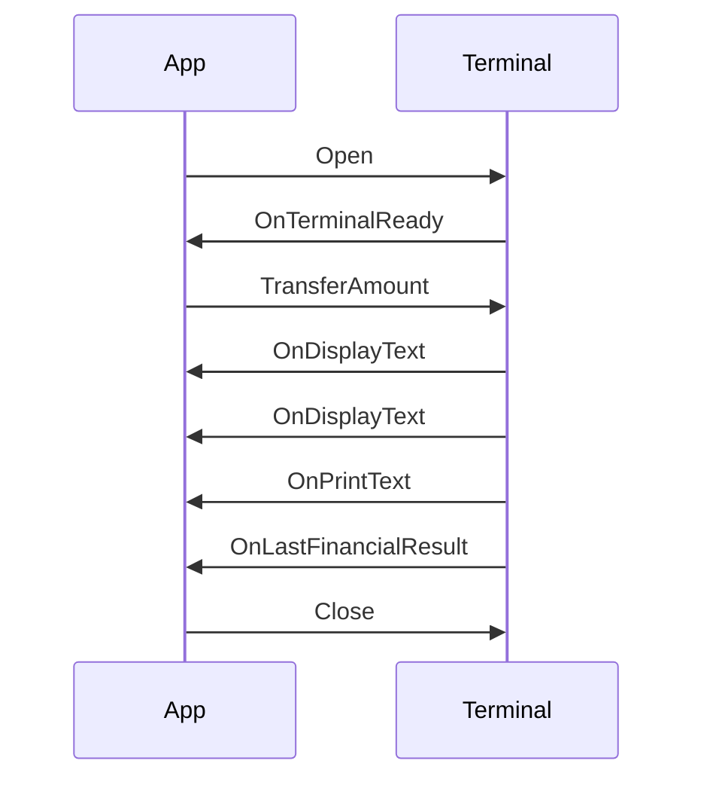

# BAXI-protokollen – Samlet rapport (dekompilering, Kotlin og Python)

**Kilde:** [instructions/baxi-decompiled.md](../instructions/baxi-decompiled.md)  
**Formål:** Én samlet dokumentasjon som forklarer hvordan BAXI-protokollen fungerer ut fra dekompilering, hva vi har, hva vi mangler, og hvordan vi implementerer i Kotlin og Python med fokus på TCP mot betalingsterminal.  
**Versjon:** 1.0  
**Dato:** Februar 2026  

---

## Innhold

1. [Tittel og formål](#tittel-og-formål)
2. [Hvordan protokollen fungerer (fra dekompilering)](#hvordan-protokollen-fungerer-fra-dekompilering)
3. [Hva vi har](#hva-vi-har)
4. [Hva vi mangler](#hva-vi-mangler)
5. [Løsning i Kotlin](#løsning-i-kotlin)
6. [Løsning i Python](#løsning-i-python)
7. [TCP-implementasjon mot betalingsterminal](#tcp-implementasjon-mot-betalingsterminal)
8. [Oppdagelsesstrategi for å fylle gap](#oppdagelsesstrategi-for-å-fylle-gap)
9. [Oppsummering](#oppsummering)

---

## Tittel og formål

Denne rapporten samler alt som følger av **dekompileringen** av Nets BAXI .NET DLL (baxi_dotnet 1.3.2.0, BBS.BAXI) beskrevet i [instructions/baxi-decompiled.md](../instructions/baxi-decompiled.md):

- **Hvordan protokollen fungerer** – livssyklus, transport (TCP og Serial), datarepresentasjon (TLD og JSON), og event-flyt.
- **Hva vi har** – full API-overflate (BaxiCtrl, args, events) og semantikk (Purchase/Refund, EOD/X/Z, resultatfelt).
- **Hva vi mangler** – konkrete verdier for TLD-tagger, koder, wire-format og sekvens; filen konkluderer: *«Vi har ikke parametrene»*.
- **Løsning i Kotlin** – arkitektur og kodeeksempler; full detalj i [BAXI_DECOMPILED_KOTLIN_RAPPORT.md](BAXI_DECOMPILED_KOTLIN_RAPPORT.md).
- **Løsning i Python** – tilsvarende; full detalj i [BAXI_DECOMPILED_PYTHON_RAPPORT.md](BAXI_DECOMPILED_PYTHON_RAPPORT.md).
- **TCP-implementasjon mot betalingsterminal** – anbefalinger for port, framing, timeout og SSL; hvordan en ny implementasjon (Kotlin eller Python) best kan testes mot ekte terminal (Nets Cloud vs direkte IP).
- **Oppdagelsesstrategi** – hvordan vi fyller gap (Wireshark, mock-server, dokumentasjon, fuzzing).

---

## Hvordan protokollen fungerer (fra dekompilering)

### Livssyklus

Typisk flyt ut fra BaxiCtrl-metoder og events:

1. **Open()** – oppretter forbindelse til terminal (TCP eller Serial).
2. **OnTerminalReady** – terminal signaliserer at den er klar (event).
3. **TransferAmount(args)** / **Administration(args)** / **SendTLD(args)** / **SendJson(args)** / **TransferCardData(args)** / **BiBAdministration(args)** / **BiBTransaction(args)** – sender kommando.
4. **Events underveis:** OnDisplayText (tekst på display), OnPrintText (kvittering), OnTLDReceived, OnJsonReceived, OnStdRsp.
5. **OnLastFinancialResult** – sluttresultat for betaling (Result, TruncatedPan, ResponseCode, etc.).
6. **OnError** – ved feil (ErrorCode, ErrorString).
7. **Close()** – lukker forbindelsen.

### To transportlag

- **TCP:** HostIpAddress, HostPort – app som klient mot terminal eller Nets Cloud.
- **Serial:** ComPort, BaudRate – RS-232/CommBase (JH.CommBase); samme protokoll kan i prinsippet brukes over begge, men wire-format kan variere (length-prefix for TCP, STX/ETX/LRC for Serial).

### To datarepresentasjoner

- **TLD (Tag-Length-Data):** SendTLD(SendTldArgs), OnTLDReceived(TLDReceivedArgs), GetTLDTag – binær format med tag, lengde og verdi; konkrete tag-verdier er ikke gitt i dekompileringen.
- **JSON:** SendJson(SendJsonArgs), OnJsonReceived(JsonReceivedArgs) – tekstbasert; nøyaktig skjema ukjent.

### Sekvensdiagram (app mot terminal)



### Proprietære utvidelser

Dekompileringsrapporten nevner at Nets og Viking-protokollen kan gjøre noe **proprietært** utover standard BAXI; det understreker behovet for trafikk-analyse eller offisiell dokumentasjon.

---

## Hva vi har

### Full API-overflate

- **BaxiCtrl:** Alle konfigurasjons- og statusegenskaper, metoder (Open, Close, Administration, TransferAmount, SendTLD, SendJson, TransferCardData, BiBAdministration, BiBTransaction, GetTLDTag), og ni events.
- **Args og EventArgs:** AdministrationArgs, TransferAmountArgs, LastFinancialResultEventArgs, LocalModeEventArgs, DisplayTextEventArgs, PrintTextEventArgs, BaxiErrorEventArgs, TLDReceivedArgs, SendTldArgs, JsonReceivedArgs, SendJsonArgs, BiBAdministrationArgs, BiBTransactionArgs, TransferCardDataArgs, StdRspReceivedArgs, TerminalReadyEventArgs.
- **IBaxiEvents:** Samme ni callbacks som på BaxiCtrl.

### Semantikk (fra feltnavn og kommentarer)

- **Type1:** Purchase=0, Refund=1 (typiske; andre verdier ukjente).
- **AdmCode:** 1=EOD/Settlement, 2=X-Report, 3=Z-Report, 10=Reconciliation (typiske).
- **Result:** 0=approved; andre verdier for avslag/feil.
- **LastFinancialResult:** TruncatedPan, ResponseCode, EMV-felter (AID, TVR, TSI, ATC, AED, IAC), TerminalID, AcquirerMerchantID, CardIssuerName, etc.

### Internt

- **QueueType:** DFS13_CONTROLLER, DFS13_LOW_LEVEL, HOST (avkuttet) – indikerer interne køer.

Kilde for alt over: [instructions/baxi-decompiled.md](../instructions/baxi-decompiled.md).

---

## Hva vi mangler

Følgende **mangler** i dekompileringen og må innhentes via trafikk-analyse eller dokumentasjon:

1. **Konkrete verdier**
   - TLD-tag-numre (hex/byte) for kommandoer og svar.
   - Lengdefelt i TLD (1 eller 2 byte), eventuell nesting.
   - Alle AdmCode-, Type1/2/3-, Result- og ErrorCode-verdier.

2. **Wire-format**
   - Framing: length-prefix (2 byte) vs STX/ETX/LRC; byte-rekkefølge (big-/little-endian).
   - Charset for tekstfelter (ISO-8859-1, UTF-8).

3. **Sekvens og handshake**
   - Nøyaktig rekkefølge etter Open; om det sendes session/Open-TLD før TransferAmount.
   - Eventuelle handshake-meldinger (f.eks. I1/I2 som i noen ECR-implementasjoner).

4. **Proprietære utvidelser**
   - Nets/Viking-spesifikke tillegg utover standard BAXI.

Filens egen konklusjon: *«Vi har ikke parametrene»* – dvs. selve parametrene Baxi-protokollen bruker er ikke tilgjengelige uten kildekode eller trafikk.

---

## Løsning i Kotlin

### Kotlin-arkitektur

- **BaxiClient** (tilsvarer BaxiCtrl): holder config, connection og event-handler.
- **Data classes:** AdministrationArgs, TransferAmountArgs, LastFinancialResult (fra LastFinancialResultEventArgs).
- **BaxiEventHandler:** interface med onDisplayText, onPrintText, onLastFinancialResult, onError, onTLDReceived, onTerminalReady, onStdRsp, onJsonReceived, onLocalMode.
- **TCP/SSL-lag:** BaxiTcpConnection for ren TCP med length-prefix; eksisterende CloudTerminalClient for SSL mot Nets Cloud (3.33.230.243:6001).

### Kodeeksempel – TransferAmountArgs og framing

```kotlin
data class TransferAmountArgs(
    val operID: String = "1",
    val type1: Int,
    val amount1: Int,
    val type2: Int = 0,
    val amount2: Int = 0,
    val type3: Int = 0,
    val amount3: Int = 0,
    val hostData: String? = null,
    val articleDetails: String? = null,
    val paymentConditionCode: String? = null,
    val authCode: String? = null,
    val optionalData: String? = null
)

fun buildLengthPrefixFrame(payload: ByteArray): ByteArray {
    val header = byteArrayOf(
        (payload.size shr 8).toByte(),
        (payload.size and 0xFF).toByte()
    )
    return header + payload
}
```

### Kodeeksempel – TCP send/receive

```kotlin
fun send(payload: ByteArray) {
    val header = byteArrayOf(
        (payload.size shr 8).toByte(),
        (payload.size and 0xFF).toByte()
    )
    output!!.write(header)
    output!!.write(payload)
    output!!.flush()
}

fun receive(): ByteArray {
    val header = ByteArray(2)
    input!!.readFully(header)
    val len = ((header[0].toInt() and 0xFF) shl 8) or (header[1].toInt() and 0xFF)
    val payload = ByteArray(len)
    input!!.readFully(payload)
    return payload
}
```

Full gjennomgang, alle data classes og event-interface: [BAXI_DECOMPILED_KOTLIN_RAPPORT.md](BAXI_DECOMPILED_KOTLIN_RAPPORT.md).

---

## Løsning i Python

### Python-arkitektur

- **BaxiClient:** bruker BaxiTcpConnection og kaller event-handler (Protocol/ABC).
- **dataclasses:** AdministrationArgs, TransferAmountArgs, LastFinancialResult.
- **BaxiEventHandler (Protocol):** on_display_text, on_print_text, on_last_financial_result, on_error, on_tld_received, on_terminal_ready, on_std_rsp, on_json_received, on_local_mode.
- **connection:** socket med length-prefix (struct.pack('>H', len)); evt. ssl.wrap_socket for Nets Cloud.

### Kodeeksempel – TransferAmountArgs og length-prefix

```python
from dataclasses import dataclass
import struct

@dataclass
class TransferAmountArgs:
    oper_id: str = "1"
    type1: int = 0
    amount1: int = 0
    type2: int = 0
    amount2: int = 0
    type3: int = 0
    amount3: int = 0

def build_length_prefix_frame(payload: bytes) -> bytes:
    return struct.pack(">H", len(payload)) + payload
```

### Kodeeksempel – TCP receive med length-prefix

```python
def recv_length_prefix(sock: socket.socket) -> bytes:
    header = sock.recv(2)
    (msg_len,) = struct.unpack(">H", header)
    data = b""
    while len(data) < msg_len:
        chunk = sock.recv(msg_len - len(data))
        if not chunk:
            raise ConnectionError("Connection closed")
        data += chunk
    return data
```

Full gjennomgang og referanse til ecr_server_v3_handshake: [BAXI_DECOMPILED_PYTHON_RAPPORT.md](BAXI_DECOMPILED_PYTHON_RAPPORT.md).

---

## TCP-implementasjon mot betalingsterminal

### Rolle

Appen (Kotlin eller Python) er **TCP-klient**; terminalen eller Nets Cloud er **server**. Typiske oppsett:

- **Nets Cloud Connect:** SSL til 3.33.230.243:6001 (TLS 1.2/1.3); samme BAXI-protokoll over kryptert kanal.
- **Direkte terminal:** Ren TCP til terminalens IP, ofte porter 3000–3010 eller 8009.

### Port-scanning

- **Typiske porter:** 3000–3010 (direkte terminal), 6001 (Nets Cloud).
- **Kotlin:** Prøv `Socket().connect(InetSocketAddress(host, port), timeout)` per port.
- **Python:** `socket.create_connection((host, port), timeout=2)` i loop eller med `concurrent.futures.ThreadPoolExecutor` for parallell skanning.

### Framing

- **TCP:** Anbefaling: **length-prefix (2 byte big-endian)** + payload, som i [TCP_ETHERNET_FRAMING.md](../_archived/baxi-protocol/TCP_ETHERNET_FRAMING.md) og [ecr_server_v3_handshake.py](../scripts/python/ecr-testing/ecr_server_v3_handshake.py).
- **Serial:** STX (0x02) + payload + ETX (0x03) + LRC (XOR over payload+ETX).

### Timeout og feilhåndtering

- **Connect timeout:** f.eks. 10 s.
- **Read timeout:** f.eks. 30 s for betaling (kortlesning kan ta tid).
- **Feilhåndtering:** Lukk socket ved timeout/IOException; logg ErrorCode/ErrorString fra OnError.

### SSL for Nets Cloud

- **Kotlin:** Bruk [CloudTerminalClient](../lpg-ehl-core/src/main/kotlin/no/cloudberries/lpg/payment/CloudTerminalClient.kt) (SSLSocket mot 3.33.230.243:6001).
- **Python:** Etter TCP connect: `ssl.wrap_socket(sock, server_hostname=host)` eller `ssl.create_default_context().wrap_socket(sock, server_hostname=host)`.

### Testing av ny implementasjon

- **Mot Nets Cloud:** Sett host/port til 3.33.230.243:6001 med SSL; send samme framing som eksisterende NetsBaxProtocol (f.eks. P;10;1;amount;0) og sammenlign med kjent fungerende klient.
- **Mot direkte terminal:** Bruk port-scan for å bekrefte port; deretter length-prefix eller STX/ETX/LRC avhengig av terminal-type (Wireshark eller mock-server for å verifisere).

---

## Oppdagelsesstrategi for å fylle gap

1. **Wireshark**
   - Fanger trafikk mellom .NET-app og terminal (eller Nets Cloud).
   - Filtrer på terminal/Nets IP; analyser første bytes (length vs STX) for framing, deretter TLD-tagger og lengder.

2. **Mock-server**
   - Python eller Kotlin server som logger alle mottatte bytes.
   - Kjør .NET-klient mot mock; send kjente kommandoer (f.eks. TransferAmount) og match format (length, tag, payload).

3. **Dokumentasjon**
   - Be Nets/Viking om TLD-tagger og koder (AdmCode, Type1/2/3, Result, ErrorCode) dersom tilgjengelig.

4. **Fuzzing**
   - I test-miljø: systematisk prøv TLD-tagger og kode-verdier for å kartlegge gyldige svar (lav risiko).

---

## Oppsummering

| Område | Har (fra dekompilering) | Mangler |
| ------ | ---------------------- | ------- |
| API-overflate | BaxiCtrl, alle args/events, IBaxiEvents | – |
| Semantikk | Purchase/Refund, EOD/X/Z, resultatfelt | Full liste AdmCode/Type/Result/ErrorCode |
| Transport | TCP (HostIpAddress, HostPort), Serial (ComPort, BaudRate) | Når hvilken; samme protokoll? |
| Datarepresentasjon | TLD og JSON (typer og feltnavn) | Tag-verdier, lengdefelt, JSON-skjema |
| Wire-format | – | Framing (length vs STX/ETX/LRC), charset |
| Sekvens | Open → events → Close | Nøyaktig rekkefølge og handshake |

**Anbefaling:** Bygg API-lag og connection-lag med **konfigurerbar framing** (length-prefix og evt. STX/ETX/LRC); bruk placeholder for TLD/JSON. Fyll inn konkrete TLD-tagger og koder når trafikk er innsamlet (Wireshark, mock-server) eller dokumentasjon er tilgjengelig. For produksjon mot Nets: bruk SSL mot 3.33.230.243:6001 og samme BAXI-format som eksisterende implementasjon.

---

**Detaljrapporter:**

- [BAXI_DECOMPILED_KOTLIN_RAPPORT.md](BAXI_DECOMPILED_KOTLIN_RAPPORT.md) – Kotlin-implementasjon med alle kodeeksempler.
- [BAXI_DECOMPILED_PYTHON_RAPPORT.md](BAXI_DECOMPILED_PYTHON_RAPPORT.md) – Python-implementasjon med alle kodeeksempler.

**Kilde:** [instructions/baxi-decompiled.md](../instructions/baxi-decompiled.md)
