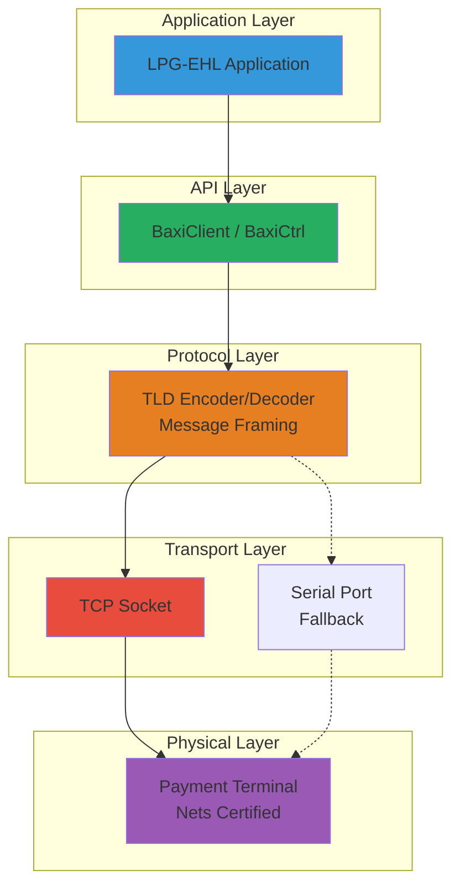

# Baxi Protocol - Comprehensive Analysis & Implementation Guide

**Document Version:** 1.0  
**Date:** February 7, 2026  
**Purpose:** Complete analysis of Nets Baxi payment terminal protocol with implementation strategies for both Kotlin and Python

---

## Executive Summary

This document provides a comprehensive analysis of the **Nets Baxi payment terminal protocol** based on decompiled .NET DLL inspection and outlines implementation strategies for both **Kotlin** (for integration with the LPG-EHL system) and **Python** (for rapid prototyping and testing).

### Key Findings

✅ **What We Have:**
- Complete API surface from decompiled DLL
- All public methods, properties, and events
- Full data structure definitions
- Clear protocol flow and lifecycle

❌ **What We're Missing:**
- Wire protocol specifications (TLD tags, message framing)
- Command codes and response formats
- Checksum/CRC algorithms
- Exact binary message structure

⚠️ **Critical Next Step:**
Network traffic capture (Wireshark) is **essential** to reverse engineer the binary protocol details.

---

## Table of Contents

1. [Protocol Overview](#protocol-overview)
2. [Decompilation Analysis](#decompilation-analysis)
3. [Protocol Architecture](#protocol-architecture)
4. [What We Know (From Decompilation)](#what-we-know-from-decompilation)
5. [What We Don't Know (Missing Details)](#what-we-dont-know-missing-details)
6. [Discovery Strategy](#discovery-strategy)
7. [Kotlin Implementation](#kotlin-implementation)
8. [Python Implementation](#python-implementation)
9. [Comparison: Kotlin vs Python](#comparison-kotlin-vs-python)
10. [Testing Strategy](#testing-strategy)
11. [Deployment Recommendations](#deployment-recommendations)
12. [Reverse Engineering Roadmap](#reverse-engineering-roadmap)

---

## Protocol Overview

### Baxi Protocol Essentials

The Baxi protocol is **Nets' proprietary binary protocol** for payment terminal communication, used throughout Norway for retail and fuel pump payments.

**Key Characteristics:**

| Aspect | Description |
|--------|-------------|
| **Transport** | TCP/IP (primary) or Serial RS-232 (fallback) |
| **Encoding** | TLD (Tag-Length-Data), similar to EMV TLV |
| **Pattern** | Command-response with asynchronous events |
| **Data Format** | Binary byte streams with embedded text |
| **Security** | Terminal-side encryption (not our responsibility) |
| **Port** | Configurable (typically 3000-3010 range) |

### Protocol Flow (Inferred)

```
┌─────────────┐                              ┌──────────────┐
│   Our App   │                              │   Terminal   │
│  (Client)   │                              │   (Server)   │
└──────┬──────┘                              └──────┬───────┘
       │                                            │
       │  1. TCP Connect                            │
       ├───────────────────────────────────────────>│
       │                                            │
       │  2. OPEN_SESSION command                   │
       ├───────────────────────────────────────────>│
       │                                            │
       │  3. TERMINAL_READY event                   │
       │<───────────────────────────────────────────┤
       │                                            │
       │  4. TRANSFER_AMOUNT (TLD: amount, type)    │
       ├───────────────────────────────────────────>│
       │                                            │
       │  5. DISPLAY_TEXT event ("INSERT CARD")     │
       │<───────────────────────────────────────────┤
       │                                            │
       │  6. DISPLAY_TEXT event ("PROCESSING...")   │
       │<───────────────────────────────────────────┤
       │                                            │
       │  7. PRINT_TEXT event (receipt lines)       │
       │<───────────────────────────────────────────┤
       │                                            │
       │  8. TRANSACTION_RESULT (TLD: status, auth) │
       │<───────────────────────────────────────────┤
       │                                            │
       │  9. CLOSE_SESSION command                  │
       ├───────────────────────────────────────────>│
       │                                            │
       │ 10. TCP Disconnect                         │
       │<───────────────────────────────────────────┤
       │                                            │
```

---

## Decompilation Analysis

### Source Material

**Assembly Information:**
- **Name**: `baxi_dotnet.dll`
- **Version**: 1.3.2.0
- **Company**: Nets AS
- **Copyright**: © Nets AS 2011
- **Framework**: .NET Framework 2.0
- **COM Visible**: True (for VB6 compatibility)
- **Anti-Decompilation**: `SuppressIldasmAttribute` present

**Decompilation Method:**
- Reflection-based API extraction (bypasses anti-decompilation)
- Cannot see internal implementation logic
- Can see all public surface area

### Namespace Structure

```
BBS.BAXI               ← Main public API
  ├── BaxiCtrl         ← Main controller class
  ├── *Args classes    ← Request parameters
  ├── *EventArgs       ← Event data
  └── BaxiException    ← Custom exception

JH.CommBase            ← Internal serial communication
  └── (Internal, not publicly visible)
```

---

## Protocol Architecture

### Conceptual Layers



### TLD (Tag-Length-Data) Format

TLD is similar to EMV TLV but with proprietary Nets tags.

**Hypothetical Structure (needs verification):**

```
┌──────┬────────┬─────────┐
│ TAG  │ LENGTH │  DATA   │
├──────┼────────┼─────────┤
│ 1-2B │  1-2B  │   N B   │
└──────┴────────┴─────────┘

Examples:
  0x04 0x04 0x00 0x00 0x27 0x10    ← Amount: 10000 øre (100.00 NOK)
  0x08 0x02 0x30 0x31              ← Operator ID: "01"
  0x39 0x01 0x00                   ← Result code: 0 (approved)
```

**Extended Length Encoding:**
- If length > 127: first byte has bit 7 set, remaining bits = number of length bytes
- Example: `0x81 0x00 0xFF` = length 255

---

## What We Know (From Decompilation)

### ✅ 1. Complete Configuration Properties

From `BaxiCtrl` class, we know **all** configuration parameters:

```csharp
// Network (TCP/IP)
string HostIpAddress      // Terminal IP address
int HostPort              // Terminal TCP port

// Serial Fallback
int ComPort               // COM port number
int BaudRate              // Serial baud rate (e.g., 115200)
string SerialDriver       // Driver type

// Logging
string LogFilePath        // Log directory path
string LogFilePrefix      // Log file name prefix
int TraceLevel            // 0-5 (OFF to TRACE)
int LogAutoDeleteDays     // Auto-delete old logs

// Terminal Features
int PrinterWidth          // Receipt printer width (characters)
int DisplayWidth          // Terminal display width
int CutterSupport         // Printer cutter: 0=No, 1=Yes
int AutoGetCustomerInfo   // Auto-retrieve card data
int Use2KBuffer           // Use 2KB buffer for communication
int TerminalReady         // Terminal ready flag
int UseDisplayTextID      // Use display text IDs vs raw text
int DisplayTextInLocalMode

// Advanced
string DeviceString       // Device identifier
string VendorInfoExtended // Vendor information
int MsgRouterOn           // Message router enabled
string MsgRouterIpAddress // Message router IP
int MsgRouterPort         // Message router port
```

### ✅ 2. Complete Method Signatures

```csharp
// Connection Management
int Open()                // Open connection → 0 = success
int Close()               // Close connection
void Dispose()            // Cleanup resources

// Transactions
int TransferAmount(TransferAmountArgs args)
    // Returns: 0 = success, negative = error
    // Triggers: OnDisplayText (multiple), OnPrintText, OnLastFinancialResult

// Administration
int Administration(AdministrationArgs args)
    // Admin operations: EOD, reports, reconciliation

// Low-Level
int SendTLD(SendTldArgs args)          // Send raw TLD data
int SendJson(SendJsonArgs jsonArgs)     // Send JSON data
int TransferCardData(TransferCardDataArgs args)  // Manual card entry

// BankInABox (BIB)
int BiBAdministration(BiBAdministrationArgs args)
int BiBTransaction(BiBTransactionArgs args)

// Utility
bool GetTLDTag(byte[] wantedTldTag, byte[] tldBuffer, out byte[] wantedTldTagValue)
```

### ✅ 3. Complete Event Definitions

```csharp
// Event: Terminal is ready for operations
event TerminalReadyEventHandler OnTerminalReady

// Event: Display text from terminal (real-time updates)
event DisplayTextEventHandler OnDisplayText
    // Args: DisplayText (string), DisplaytextSourceID (int), DisplaytextID (int)

// Event: Receipt text for printing
event PrintTextEventHandler OnPrintText
    // Args: PrintText (string) - can be multi-line

// Event: Transaction result
event LastFinancialResultEventHandler OnLastFinancialResult
    // Args: ResultData, Result, TruncatedPan, AuthCode, Amount, etc. (see below)

// Event: Local mode transaction (terminal-initiated)
event LocalModeEventHandler OnLocalMode
    // Args: Same as OnLastFinancialResult

// Event: Error notification
event BaxiErrorEventHandler OnError
    // Args: ErrorCode (int), ErrorString (string)

// Event: TLD data received
event TLDReceivedHandler OnTLDReceived
    // Args: TldType (string), TldData (byte[])

// Event: Standard response
event StdRspReceivedHandler OnStdRsp
    // Args: Response (string)

// Event: JSON data received
event JsonReceivedHandler OnJsonReceived
    // Args: JsonString (string)
```

### ✅ 4. Complete Data Structures

**TransferAmountArgs (Request):**
```csharp
string OperID              // Operator ID (e.g., "01")
int Type1                  // Transaction type: 0=Purchase, 1=Refund, etc.
int Amount1                // Amount in øre (smallest currency unit)
int Type2, Amount2         // Secondary amounts (e.g., tip)
int Type3, Amount3         // Tertiary amounts (e.g., surcharge)
string HostData            // Host-specific data
string ArticleDetails      // Product details
string PaymentConditionCode
string AuthCode            // For forced authorization
string OptionalData
```

**LastFinancialResultEventArgs (Response):**
```csharp
string ResultData          // Raw result data
int Result                 // 0=Approved, else=Rejected
int AccumulatorUpdate      // Update accumulator flag
int IssuerId               // Card issuer ID
string TruncatedPan        // Masked card number (e.g., "****1234")
string Timestamp           // Transaction timestamp
int VerificationMethod     // CVM: 0=None, 1=Signature, 2=PIN, 3=PIN+Signature
string SessionNumber       // Session/batch number
string StanAuth            // STAN/Authorization number
string SequenceNumber      // Sequence number
int TotalAmount            // Total amount charged
int RejectionSource        // Rejection source code
string RejectionReason     // Rejection reason text
int TipAmount              // Tip amount
int SurchargeAmount        // Surcharge amount
string TerminalID          // Terminal ID (TID)
string AcquirerMerchantID  // Merchant ID
string CardIssuerName      // Issuer name (VISA, Mastercard, etc.)
string ResponseCode        // ISO 8583 response code
string TCC                 // Transaction Currency Code
string AID                 // EMV Application Identifier
string TVR                 // EMV Terminal Verification Results
string TSI                 // EMV Transaction Status Information
string ATC                 // EMV Application Transaction Counter
string AED                 // Application Expiry Date
string IAC                 // Issuer Action Code
string OrganisationNumber  // Organization number
string BankAgent           // Bank agent info
string EncryptedPAN        // Encrypted PAN (for tokenization)
string AccountType         // Account type
string OptionalData        // Optional extra data
```

### ✅ 5. Inferred Administration Codes

Based on typical Baxi implementations (needs verification):

```csharp
AdmCode Values:
  1  = End of Day (EOD) / Settlement
  2  = X-Report (no settlement)
  3  = Z-Report (with settlement)
  10 = Reconciliation
  20 = Reprint last receipt
  30 = Terminal diagnostics
  40 = Parameter download
```

---

## What We Don't Know (Missing Details)

### ❌ 1. TLD Tag Definitions

**We don't know the actual tag values.** Examples of unknown tags:

```
Tag for Amount:        0x04? 0x9F02? 0x81?
Tag for Result Code:   0x39? 0x8A? 0x90?
Tag for Operator ID:   0x08? 0x9F03?
Tag for PAN:           0x57? 0x5A?
Tag for Auth Code:     0x38? 0x89?
Tag for Timestamp:     0x12? 0x9A?
Tag for Display Text:  0xD0? 0xC0?
```

**Impact:** Cannot construct valid TLD messages without knowing tags.

**Discovery Method:** Wireshark capture + packet analysis

### ❌ 2. Message Framing Format

**We don't know how messages are delimited and structured.**

**Possible Formats:**

**Format A (STX/ETX with Length):**
```
[STX:0x02][LENGTH:2 bytes][COMMAND:1 byte][TLD_DATA][CRC:2 bytes][ETX:0x03]
```

**Format B (Length Prefix Only):**
```
[LENGTH:2 bytes][COMMAND:1 byte][TLD_DATA][CRC:2 bytes]
```

**Format C (Command + Length):**
```
[COMMAND:1 byte][LENGTH:2 bytes][TLD_DATA][CRC:2 bytes]
```

**Impact:** Cannot parse incoming messages or frame outgoing messages.

**Discovery Method:** Wireshark capture showing first few bytes of packets

### ❌ 3. Command Codes

**We don't know the byte values for each command.**

**Hypothetical Examples:**

```
OPEN_SESSION:       0x10?
CLOSE_SESSION:      0x11?
TRANSFER_AMOUNT:    0x20? 0x06?
ADMINISTRATION:     0x60?
SEND_TLD:           0x30?

// Responses/Events
TERMINAL_READY:     0x70? 0x80?
DISPLAY_TEXT:       0x71? 0xD0?
PRINT_TEXT:         0x72? 0xD1?
TRANSACTION_RESULT: 0x73? 0x90?
```

**Impact:** Cannot initiate operations or identify response types.

**Discovery Method:** Wireshark capture correlating C# method calls with sent packets

### ❌ 4. Checksum/CRC Algorithm

**We don't know the error detection mechanism.**

**Possibilities:**

1. **XOR Checksum** (simplest):
   ```
   checksum = byte1 XOR byte2 XOR byte3 XOR ...
   ```

2. **LRC (Longitudinal Redundancy Check)**:
   ```
   lrc = ~(sum of all bytes) & 0xFF
   ```

3. **CRC-16 CCITT**:
   ```
   polynomial: 0x1021
   initial: 0xFFFF
   ```

4. **CRC-16 Modbus**:
   ```
   polynomial: 0x8005
   initial: 0xFFFF
   ```

**Impact:** Messages may be rejected as invalid.

**Discovery Method:** Analyze multiple packets, try common algorithms, verify which matches

### ❌ 5. Response/Error Codes

**We don't know the meaning of result codes.**

**Likely ISO 8583 Standard:**

```
00 = Approved
05 = Do not honor
51 = Insufficient funds
54 = Expired card
55 = Incorrect PIN
91 = Issuer unavailable
96 = System malfunction
```

But Nets may have custom codes.

**Impact:** Cannot provide meaningful error messages to users.

**Discovery Method:** Test various scenarios (declined card, wrong PIN, etc.) and observe codes

### ❌ 6. Character Encoding

**We don't know the text encoding for display/print text.**

**Possibilities:**

- **ASCII** (7-bit)
- **ISO-8859-1** (Latin-1) - likely for Norwegian characters (æ, ø, å)
- **UTF-8**
- **Windows-1252** (CP1252)

**Impact:** Display text may show garbled Norwegian characters.

**Discovery Method:** Send transaction, observe display text in capture, test with Norwegian text

### ❌ 7. Nested TLD Structures

**We don't know if TLD fields can contain nested TLD structures.**

Example of nested TLD (EMV-style):

```
Tag 0x70 (EMV Data Object List):
  Length: 50 bytes
  Data:
    Tag 0x9F26 (Application Cryptogram): ...
    Tag 0x9F27 (Cryptogram Information Data): ...
    Tag 0x9F10 (Issuer Application Data): ...
```

**Impact:** Cannot parse complex EMV-related data.

**Discovery Method:** Analyze `TerminalDeviceData_TLD` and EMV-related fields

---

## Discovery Strategy

### Phase 1: Network Traffic Capture (CRITICAL)

**Objective:** Capture raw TCP packets between original DLL and terminal.

**Tools:**
- **Wireshark** (Windows/Mac/Linux)
- **tcpdump** (Linux)
- **Microsoft Network Monitor** (Windows)

**Process:**

1. **Setup Capture Environment:**
   ```
   PC (Windows) ── Wireshark ── Terminal
                       │
                   [Capture]
   ```

2. **Create Test Application (C#):**
   ```csharp
   using BBS.BAXI;
   
   var baxi = new BaxiCtrl();
   baxi.HostIpAddress = "192.168.1.100";
   baxi.HostPort = 3000;
   baxi.TraceLevel = 5;  // Max logging
   
   // Log all events
   baxi.OnTLDReceived += (s, e) => {
       File.AppendAllText("tld_log.txt",
           $"{DateTime.Now:HH:mm:ss.fff} TLD: {BitConverter.ToString(e.TldData)}\n");
   };
   
   baxi.OnDisplayText += (s, e) => {
       Console.WriteLine($"Display: {e.DisplayText}");
   };
   
   baxi.OnLastFinancialResult += (s, e) => {
       Console.WriteLine($"Result: {e.Result}, Auth: {e.AuthCode}");
   };
   
   // Perform operations
   baxi.Open();
   
   var args = new TransferAmountArgs {
       OperID = "01",
       Type1 = 0,        // Purchase
       Amount1 = 10000   // 100.00 NOK
   };
   baxi.TransferAmount(args);
   
   baxi.Close();
   ```

3. **Start Wireshark Capture:**
   ```
   - Filter: tcp.port == 3000
   - Capture during: Open → Transaction → Close
   ```

4. **Perform Test Operations:**
   - Open connection (observe OPEN_SESSION packet)
   - Simple purchase (observe TRANSFER_AMOUNT packet)
   - Administration (observe ADMINISTRATION packet)
   - Close connection (observe CLOSE_SESSION packet)

5. **Analyze Captured Packets:**
   - Right-click packet → Follow TCP Stream
   - Export as hex dump
   - Look for patterns:
     - STX/ETX bytes (0x02, 0x03)
     - Length fields (2-byte values)
     - Command codes (recurring byte values)
     - TLD structures (tag-length-value patterns)

**Expected Output:**

```
Packet 1 (Client → Terminal): OPEN_SESSION
0000: 02 00 05 10 00 00 12 34 03
      ││ │││ ││ ││    │││ ││
      ││ │││ ││ ││    │││ └└ ETX
      ││ │││ ││ ││    └└└ CRC
      ││ │││ ││ └└ Empty TLD data
      ││ │││ └└ Command: 0x10 (OPEN_SESSION)
      ││ └└└ Length: 5 bytes
      └└ STX

Packet 2 (Terminal → Client): TERMINAL_READY
0000: 02 00 04 70 12 34 03
      ││ │││ ││ │││ ││
      ││ │││ ││ │││ └└ ETX
      ││ │││ ││ └└└ CRC
      ││ │││ └└ Command: 0x70 (TERMINAL_READY)
      ││ └└└ Length: 4 bytes
      └└ STX
```

### Phase 2: Protocol Analysis

**Objective:** Deduce protocol structure from captures.

**Tools:**
- **Python + scapy**
- **HexEdit** (hex editor)
- **Excel** (for tabulating patterns)

**Process:**

1. **Extract All Packets:**
   ```python
   from scapy.all import *
   
   packets = rdpcap('baxi_capture.pcap')
   
   for i, pkt in enumerate(packets):
       if TCP in pkt and pkt[TCP].dport == 3000:
           print(f"Packet {i} (Client → Terminal):")
           print(pkt[TCP].payload.hex())
       elif TCP in pkt and pkt[TCP].sport == 3000:
           print(f"Packet {i} (Terminal → Client):")
           print(pkt[TCP].payload.hex())
   ```

2. **Identify Patterns:**
   - First byte: Always 0x02? → STX
   - Last byte: Always 0x03? → ETX
   - Bytes 1-2: Incrementing values? → Length field
   - Byte 3: Different per operation? → Command code

3. **Build Tag Dictionary:**
   ```python
   # Correlate TLD log with captured packets
   # Look for recurring patterns
   
   known_tags = {
       0x04: "Amount",       # Appears with transaction amount
       0x08: "Operator ID",  # Appears with "01" string
       0x39: "Result Code",  # Appears in result packet
       0x57: "PAN",          # Appears with masked card number
   }
   ```

4. **Test Checksum Algorithms:**
   ```python
   import struct
   
   def test_crc16(data):
       crc = 0xFFFF
       for byte in data:
           crc ^= (byte << 8)
           for _ in range(8):
               if crc & 0x8000:
                   crc = (crc << 1) ^ 0x1021
               else:
                   crc <<= 1
               crc &= 0xFFFF
       return crc ^ 0xFFFF
   
   # Test against captured packets
   packet_data = bytes.fromhex("10000004000027100203")
   calculated_crc = test_crc16(packet_data[3:-3])  # Exclude STX, length, ETX
   received_crc = struct.unpack('>H', packet_data[-3:-1])[0]
   
   if calculated_crc == received_crc:
       print("CRC-16 CCITT confirmed!")
   ```

### Phase 3: Incremental Implementation

**Objective:** Implement and test one feature at a time.

**Process:**

1. **Implement Message Framing:**
   - Test with mock data
   - Verify framing/parsing works

2. **Implement TLD Codec:**
   - Start with known tags (from analysis)
   - Test encode/decode

3. **Implement Basic Commands:**
   - OPEN_SESSION
   - CLOSE_SESSION

4. **Test Against Real Terminal:**
   - Send OPEN_SESSION
   - Expect TERMINAL_READY
   - Validate response

5. **Implement Transaction Flow:**
   - TRANSFER_AMOUNT command
   - Handle DISPLAY_TEXT events
   - Parse TRANSACTION_RESULT

6. **Implement Error Handling:**
   - Handle malformed packets
   - Handle timeouts
   - Handle reconnection

### Phase 4: Validation & Testing

**Objective:** Ensure implementation works reliably.

**Tests:**

1. **Approved Transaction:**
   - Insert valid card
   - Enter correct PIN
   - Verify result code = 0

2. **Declined Transaction:**
   - Use test card with insufficient funds
   - Verify result code != 0
   - Verify rejection reason

3. **Timeout Handling:**
   - Start transaction, don't insert card
   - Verify timeout after N seconds

4. **Reconnection:**
   - Disconnect terminal during transaction
   - Verify automatic reconnection

5. **Administration:**
   - End of Day
   - X-Report
   - Verify receipt printing

---

## Kotlin Implementation

### Why Kotlin for LPG-EHL Integration?

**Advantages:**

1. ✅ **Type Safety:** Compile-time error checking
2. ✅ **Null Safety:** No null pointer exceptions
3. ✅ **Coroutines:** Natural async/await for I/O
4. ✅ **Interoperability:** Can call Java libraries
5. ✅ **Data Classes:** Concise model definitions
6. ✅ **Spring Boot Integration:** Seamless with existing LPG-EHL backend
7. ✅ **Single JAR Deployment:** Easy to deploy

**Disadvantages:**

1. ⚠️ **Verbose for Prototyping:** More boilerplate than Python
2. ⚠️ **Compilation Step:** Slower iteration during reverse engineering

### Kotlin Architecture

```
no.cloudberries.lpg.payment.baxi/
├── BaxiClient.kt              // Main API
├── BaxiConfiguration.kt        // Configuration data class
├── BaxiConnection.kt           // TCP socket management
├── protocol/
│   ├── TLDCodec.kt             // TLD encoding/decoding
│   ├── MessageFraming.kt       // Message framing
│   └── CommandCodes.kt         // Protocol constants
├── model/
│   ├── TransactionRequest.kt
│   ├── TransactionResult.kt
│   └── BaxiError.kt
└── handlers/
    └── BaxiEventHandler.kt     // Event callback interface
```

### Core Implementation Snippets

**Configuration:**
```kotlin
data class BaxiConfiguration(
    val hostIpAddress: String = "192.168.1.100",
    val hostPort: Int = 3000,
    val connectionTimeout: Duration = 10.seconds,
    val readTimeout: Duration = 60.seconds,
    val operatorId: String = "01",
    val logFilePath: String = "/var/log/lpg-ehl/baxi",
    val autoGetCustomerInfo: Boolean = true
)
```

**TLD Codec:**
```kotlin
object TLDCodec {
    fun encodeTLD(tag: Int, data: ByteArray): ByteArray {
        val output = ByteArrayOutputStream()
        
        // Tag (1 or 2 bytes)
        if (tag <= 0xFF) {
            output.write(tag)
        } else {
            output.write((tag shr 8) and 0xFF)
            output.write(tag and 0xFF)
        }
        
        // Length
        if (data.size <= 0x7F) {
            output.write(data.size)
        } else {
            output.write(0x80 or ((data.size shr 8) and 0xFF))
            output.write(data.size and 0xFF)
        }
        
        // Data
        output.write(data)
        
        return output.toByteArray()
    }
    
    fun decodeTLD(buffer: ByteArray): Map<Int, ByteArray> {
        // Implementation...
    }
}
```

**Message Framing:**
```kotlin
object MessageFraming {
    const val STX: Byte = 0x02
    const val ETX: Byte = 0x03
    
    fun frameMessage(command: Byte, tldData: ByteArray): ByteArray {
        val output = ByteArrayOutputStream()
        
        // STX
        output.write(STX.toInt())
        
        // Length (2 bytes, big-endian)
        val length = 1 + tldData.size + 2
        output.write((length shr 8) and 0xFF)
        output.write(length and 0xFF)
        
        // Command
        output.write(command.toInt())
        
        // TLD Data
        output.write(tldData)
        
        // CRC
        val crc = calculateCRC(command, tldData)
        output.write((crc shr 8) and 0xFF)
        output.write(crc and 0xFF)
        
        // ETX
        output.write(ETX.toInt())
        
        return output.toByteArray()
    }
    
    private fun calculateCRC(command: Byte, data: ByteArray): Int {
        // CRC-16 CCITT implementation
    }
}
```

**TCP Connection:**
```kotlin
class BaxiConnection(
    private val config: BaxiConfiguration,
    private val eventHandler: BaxiEventHandler
) {
    private var socket: Socket? = null
    private val scope = CoroutineScope(Dispatchers.IO + SupervisorJob())
    
    suspend fun open(): Result<Unit> = withContext(Dispatchers.IO) {
        try {
            socket = Socket()
            socket?.connect(
                InetSocketAddress(config.hostIpAddress, config.hostPort),
                config.connectionTimeout.inWholeMilliseconds.toInt()
            )
            
            startReceiveLoop()
            sendCommand(Commands.OPEN_SESSION, byteArrayOf())
            
            Result.success(Unit)
        } catch (e: Exception) {
            Result.failure(e)
        }
    }
    
    private fun startReceiveLoop() {
        scope.launch {
            // Receive loop implementation
        }
    }
}
```

**Main Client:**
```kotlin
class BaxiClient(
    private val config: BaxiConfiguration,
    private val eventHandler: BaxiEventHandler
) {
    private val connection = BaxiConnection(config, eventHandler)
    
    suspend fun transferAmount(
        amount: Int,
        transactionType: TransactionType
    ): Result<TransactionResult> {
        val tldData = TLDCodec.buildTransactionRequest(
            operatorId = config.operatorId,
            transactionType = transactionType.code,
            amount = amount
        )
        
        connection.sendCommand(Commands.TRANSFER_AMOUNT, tldData)
        
        // Wait for result
        return waitForTransactionResult()
    }
}
```

### Kotlin Testing Strategy

**Unit Tests (JUnit 5):**
```kotlin
class TLDCodecTest {
    @Test
    fun `encode TLD field correctly`() {
        val data = "TEST".toByteArray()
        val tld = TLDCodec.encodeTLD(0x04, data)
        
        assertEquals(0x04, tld[0].toInt())
        assertEquals(4, tld[1].toInt())
        assertArrayEquals(data, tld.copyOfRange(2, 6))
    }
}
```

**Integration Tests (with Mock Terminal):**
```kotlin
@Test
fun `transfer amount successfully`() = runBlocking {
    val client = BaxiClient(testConfig)
    client.open().getOrThrow()
    
    val result = client.transferAmount(10000, TransactionType.PURCHASE).getOrThrow()
    
    assertTrue(result.isApproved)
}
```

### Kotlin Deployment

**Spring Boot Integration:**
```kotlin
@Configuration
class BaxiPaymentConfiguration {
    @Bean
    fun baxiClient(config: BaxiConfiguration): BaxiClient {
        return BaxiClient(config, LpgBaxiEventHandler())
    }
}

@Service
class PaymentService(private val baxiClient: BaxiClient) {
    suspend fun processPayment(amount: Int): PaymentResult {
        val result = baxiClient.transferAmount(amount, TransactionType.PURCHASE)
        return result.getOrElse { error -> 
            PaymentResult.Error(error.message)
        }
    }
}
```

---

## Python Implementation

### Why Python for Protocol Work?

**Advantages:**

1. ✅ **Rapid Prototyping:** Fastest iteration cycle
2. ✅ **Interactive REPL:** Test ideas immediately
3. ✅ **Clean Byte Handling:** Natural syntax for binary data
4. ✅ **Excellent Libraries:** `struct`, `asyncio`, `scapy`
5. ✅ **Easy Debugging:** Print hex dumps easily
6. ✅ **Scripting:** Perfect for analysis tools

**Disadvantages:**

1. ⚠️ **Less Type Safety:** Runtime errors instead of compile-time
2. ⚠️ **Performance:** Slower than Kotlin for high-throughput
3. ⚠️ **Deployment:** Requires Python runtime

### Python Architecture

```
baxi_protocol/
├── __init__.py
├── client.py              # Main BaxiClient class
├── config.py              # Configuration dataclass
├── connection.py          # TCP socket management
├── protocol/
│   ├── tld_codec.py       # TLD encoding/decoding
│   ├── framing.py         # Message framing
│   └── commands.py        # Command constants
└── models/
    ├── transaction.py     # Transaction models
    ├── events.py          # Event models
    └── errors.py          # Error types
```

### Core Implementation Snippets

**Configuration:**
```python
from dataclasses import dataclass

@dataclass
class BaxiConfiguration:
    host_ip: str = "192.168.1.100"
    host_port: int = 3000
    connection_timeout: float = 10.0
    read_timeout: float = 60.0
    operator_id: str = "01"
    log_file_path: str = "/var/log/lpg-ehl/baxi"
    auto_get_customer_info: bool = True
```

**TLD Codec:**
```python
import struct
from io import BytesIO

class TLDCodec:
    @staticmethod
    def encode_tld(tag: int, data: bytes) -> bytes:
        output = BytesIO()
        
        # Tag (1 or 2 bytes)
        if tag <= 0xFF:
            output.write(struct.pack('B', tag))
        else:
            output.write(struct.pack('>H', tag))
        
        # Length
        length = len(data)
        if length <= 0x7F:
            output.write(struct.pack('B', length))
        else:
            output.write(struct.pack('B', 0x80 | ((length.bit_length() + 7) // 8)))
            output.write(struct.pack('>H', length))
        
        # Data
        output.write(data)
        
        return output.getvalue()
    
    @staticmethod
    def decode_tld(buffer: bytes) -> dict:
        # Implementation...
        pass
```

**Message Framing:**
```python
import struct

class MessageFraming:
    STX = 0x02
    ETX = 0x03
    
    @staticmethod
    def frame_message(command: int, tld_data: bytes) -> bytes:
        # Calculate length
        length = 1 + len(tld_data) + 2
        
        # Build message
        msg = bytearray()
        msg.append(MessageFraming.STX)
        msg.extend(struct.pack('>H', length))
        msg.append(command)
        msg.extend(tld_data)
        
        # Calculate CRC
        crc = MessageFraming._calculate_crc(bytes([command]) + tld_data)
        msg.extend(struct.pack('>H', crc))
        
        msg.append(MessageFraming.ETX)
        
        return bytes(msg)
    
    @staticmethod
    def _calculate_crc(data: bytes) -> int:
        # CRC-16 CCITT implementation
        crc = 0xFFFF
        for byte in data:
            crc ^= (byte << 8)
            for _ in range(8):
                if crc & 0x8000:
                    crc = (crc << 1) ^ 0x1021
                else:
                    crc <<= 1
                crc &= 0xFFFF
        return crc ^ 0xFFFF
```

**TCP Connection (asyncio):**
```python
import asyncio

class BaxiConnection:
    def __init__(self, config: BaxiConfiguration, event_callback):
        self.config = config
        self.event_callback = event_callback
        self._reader = None
        self._writer = None
        self._connected = False
    
    async def open(self):
        self._reader, self._writer = await asyncio.wait_for(
            asyncio.open_connection(
                self.config.host_ip,
                self.config.host_port
            ),
            timeout=self.config.connection_timeout
        )
        
        self._connected = True
        asyncio.create_task(self._receive_loop())
        await self.send_command(CommandCodes.OPEN_SESSION, b'')
    
    async def _receive_loop(self):
        while self._connected:
            data = await self._reader.read(2048)
            if not data:
                break
            # Handle received data
```

**Main Client:**
```python
class BaxiClient:
    def __init__(self, config: BaxiConfiguration, event_handler):
        self.config = config
        self.event_handler = event_handler
        self._connection = BaxiConnection(config, self._event_callback)
    
    async def open(self):
        await self._connection.open()
    
    async def transfer_amount(
        self,
        amount: int,
        transaction_type: TransactionType
    ) -> TransactionResult:
        tld_data = TLDCodec.build_transaction_request(
            operator_id=self.config.operator_id,
            transaction_type=transaction_type,
            amount=amount
        )
        
        await self._connection.send_command(
            CommandCodes.TRANSFER_AMOUNT,
            tld_data
        )
        
        # Wait for result
        return await self._wait_for_transaction_result()
```

### Python Testing Strategy

**Unit Tests (pytest):**
```python
def test_encode_tld_simple():
    data = b'TEST'
    tld = TLDCodec.encode_tld(0x04, data)
    
    assert tld[0] == 0x04  # Tag
    assert tld[1] == 4     # Length
    assert tld[2:6] == data  # Data
```

**Integration Tests (pytest-asyncio):**
```python
@pytest.mark.asyncio
async def test_transfer_amount_approved(baxi_client, mock_terminal):
    mock_terminal.set_next_response(approved=True, auth_code="123456")
    
    result = await baxi_client.transfer_amount(
        amount=10000,
        transaction_type=TransactionType.PURCHASE
    )
    
    assert result.is_approved
    assert result.auth_code == "123456"
```

### Python Protocol Analysis Tools

**Packet Analyzer:**
```python
from scapy.all import *

def analyze_baxi_capture(pcap_file):
    packets = rdpcap(pcap_file)
    
    for pkt in packets:
        if TCP in pkt and pkt[TCP].dport == 3000:
            payload = bytes(pkt[TCP].payload)
            print(f"Client → Terminal: {payload.hex()}")
            
            # Try to parse
            if len(payload) >= 6 and payload[0] == 0x02:
                length = struct.unpack('>H', payload[1:3])[0]
                command = payload[3]
                print(f"  Command: 0x{command:02x}, Length: {length}")
```

**TLD Explorer:**
```python
def explore_tld_structure(hex_string):
    data = bytes.fromhex(hex_string)
    fields = TLDCodec.decode_tld(data)
    
    for tag, value in fields.items():
        print(f"Tag 0x{tag:02x}: {value.hex()} ({value})")
```

---

## Comparison: Kotlin vs Python

### Feature Comparison Matrix

| Feature | Kotlin | Python | Winner |
|---------|--------|--------|--------|
| **Type Safety** | ✅ Compile-time | ⚠️ Runtime | Kotlin |
| **Null Safety** | ✅ Built-in | ⚠️ Optional (typing) | Kotlin |
| **Byte Handling** | ⚠️ Verbose | ✅ Natural | Python |
| **Async/Await** | ✅ Coroutines | ✅ asyncio | Tie |
| **REPL Testing** | ⚠️ Limited | ✅ Excellent | Python |
| **Prototyping Speed** | ⚠️ Slower | ✅ Fastest | Python |
| **Production Performance** | ✅ Fast | ⚠️ Slower | Kotlin |
| **Spring Boot Integration** | ✅ Native | ⚠️ Via REST | Kotlin |
| **Single Binary Deploy** | ✅ JAR | ❌ Needs runtime | Kotlin |
| **Protocol Analysis Tools** | ⚠️ Manual | ✅ scapy, etc. | Python |
| **Learning Curve** | ⚠️ Steeper | ✅ Gentle | Python |
| **IDE Support** | ✅ Excellent | ✅ Excellent | Tie |
| **Community Libraries** | ✅ Good | ✅ Excellent | Tie |

### When to Use Kotlin

✅ **Use Kotlin for:**

1. **Production Integration**: Direct integration with LPG-EHL backend
2. **Type Safety Critical**: Financial transactions require correctness
3. **Long-Term Maintenance**: Better refactoring and IDE support
4. **Spring Boot Apps**: Seamless Spring integration
5. **Performance**: High-throughput payment processing

### When to Use Python

✅ **Use Python for:**

1. **Protocol Reverse Engineering**: Fast iteration, easy debugging
2. **Analysis Tools**: Packet parsing, TLD exploration
3. **Prototyping**: Quick proof-of-concept
4. **Testing Tools**: Mock terminal, fuzzing
5. **Standalone Scripts**: Command-line utilities

### Recommended Hybrid Approach

**Best Strategy:**

1. **Use Python for Discovery Phase:**
   - Analyze Wireshark captures
   - Build TLD tag dictionary
   - Test framing algorithms
   - Create protocol documentation

2. **Use Kotlin for Production:**
   - Implement production client
   - Integrate with LPG-EHL
   - Deploy as part of backend service

3. **Use Python for Testing:**
   - Mock terminal implementation
   - Protocol fuzzing tools
   - Regression test suite

**Example Workflow:**

```
Phase 1: Discovery (Python)
├── Capture packets with Wireshark
├── Analyze with Python + scapy
├── Build TLD tag dictionary
└── Document protocol specification

Phase 2: Prototyping (Python)
├── Implement basic client
├── Test against real terminal
├── Validate protocol understanding
└── Create test suite

Phase 3: Production (Kotlin)
├── Implement Kotlin client
├── Integrate with Spring Boot
├── Add event handling
└── Deploy to production

Phase 4: Maintenance (Both)
├── Python: Analysis tools
└── Kotlin: Production code
```

---

## Testing Strategy

### Test Pyramid

```
         ┌─────────────────┐
         │   E2E Tests     │ ← Real terminal
         │  (Few, Slow)    │
         └─────────────────┘
              ┌─────────────────────┐
              │  Integration Tests  │ ← Mock terminal
              │  (Some, Medium)     │
              └─────────────────────┘
                   ┌──────────────────────────┐
                   │      Unit Tests          │ ← TLD, Framing
                   │    (Many, Fast)          │
                   └──────────────────────────┘
```

### Test Scenarios

**1. Unit Tests:**

```kotlin
// TLD Encoding
@Test fun `encode simple TLD`() { ... }
@Test fun `encode extended length TLD`() { ... }
@Test fun `decode multiple TLD fields`() { ... }

// Message Framing
@Test fun `frame command correctly`() { ... }
@Test fun `parse valid message`() { ... }
@Test fun `reject invalid CRC`() { ... }
@Test fun `reject malformed message`() { ... }

// CRC Calculation
@Test fun `CRC-16 CCITT correct`() { ... }
```

**2. Integration Tests (Mock Terminal):**

```kotlin
// Connection
@Test fun `open connection successfully`()
@Test fun `handle connection timeout`()
@Test fun `handle connection refused`()
@Test fun `reconnect after disconnect`()

// Transactions
@Test fun `approved transaction flow`()
@Test fun `rejected transaction flow`()
@Test fun `timeout during transaction`()
@Test fun `cancel transaction`()

// Events
@Test fun `receive display text events`()
@Test fun `receive print text events`()
@Test fun `handle error events`()

// Administration
@Test fun `perform end of day`()
@Test fun `print X-report`()
```

**3. E2E Tests (Real Terminal):**

```kotlin
// Smoke Tests
@Test fun `basic purchase flow`()
@Test fun `basic refund flow`()

// Error Scenarios
@Test fun `declined card`()
@Test fun `wrong PIN`()
@Test fun `expired card`()
@Test fun `insufficient funds`()

// Edge Cases
@Test fun `zero amount transaction`()
@Test fun `maximum amount transaction`()
@Test fun `concurrent transactions`() // If supported
```

### Mock Terminal Implementation

**Features:**

- ✅ Simulates OPEN_SESSION / CLOSE_SESSION
- ✅ Responds to TRANSFER_AMOUNT with configurable result
- ✅ Sends DISPLAY_TEXT events
- ✅ Sends PRINT_TEXT events (receipt)
- ✅ Configurable delays (simulate card insertion)
- ✅ Configurable responses (approved/rejected)
- ✅ Error injection (network failures, timeouts)

**Example (Python):**

```python
class MockBaxiTerminal:
    def __init__(self, port=3000):
        self.port = port
        self._next_response = {'approved': True}
    
    async def start(self):
        self._server = await asyncio.start_server(
            self._handle_client,
            'localhost',
            self.port
        )
    
    def set_next_response(self, approved: bool, auth_code: str = ''):
        self._next_response = {'approved': approved, 'auth_code': auth_code}
    
    async def _handle_client(self, reader, writer):
        while True:
            data = await reader.read(2048)
            message = MessageFraming.parse_message(data)
            
            if message.command == CommandCodes.TRANSFER_AMOUNT:
                # Simulate processing
                await asyncio.sleep(2)
                
                # Send result
                result = self._build_result()
                writer.write(result)
                await writer.drain()
```

---

## Deployment Recommendations

### Development Environment

**For Protocol Discovery:**

```
┌──────────────┐    Wireshark    ┌──────────────┐
│   Windows PC │◄───────────────►│   Terminal   │
│  (Test App)  │                 │  (Real/Mock)  │
└──────────────┘                 └──────────────┘
       │
       ▼
   Python Analysis
   Tools (scapy)
```

**Tools:**
- Wireshark
- Python 3.10+ with `scapy`, `asyncio`
- .NET SDK (for test app)
- Real Nets terminal (borrowed for testing)

### Production Environment

**For LPG-EHL Integration:**

```
┌─────────────────────────────────────┐
│   LPG-EHL System (Spring Boot)      │
│                                     │
│  ┌────────────────────────────────┐ │
│  │   BaxiClient (Kotlin)          │ │
│  │   - TCP Connection             │ │
│  │   - TLD Codec                  │ │
│  │   - Event Handling             │ │
│  └─────────────┬──────────────────┘ │
│                │                    │
└────────────────┼────────────────────┘
                 │ TCP
                 ▼
          ┌──────────────┐
          │   Terminal   │
          │ (Nets Baxi)  │
          └──────────────┘
```

**Requirements:**
- Java 17+
- Kotlin 2.1+
- Spring Boot 3.2+
- Network access to terminal (local network)
- Terminal IP: Static or reserved DHCP

### Deployment Configurations

**1. Single Terminal (Typical Gas Station):**

```yaml
# application.yaml
payment:
  terminal:
    enabled: true
    host: "192.168.1.100"
    port: 3000
    operator-id: "01"
    timeout: 60s
    reconnect-attempts: 3
```

**2. Multiple Terminals (Large Station):**

```yaml
payment:
  terminals:
    - id: "pump-1"
      host: "192.168.1.101"
      port: 3000
    - id: "pump-2"
      host: "192.168.1.102"
      port: 3000
```

**3. Development (Mock Terminal):**

```yaml
payment:
  terminal:
    enabled: true
    host: "localhost"
    port: 3000
    mock: true  # Use MockBaxiTerminal
```

### Monitoring & Logging

**Key Metrics:**

- **Transaction Success Rate**: % of approved transactions
- **Transaction Duration**: Time from start to result
- **Connection Uptime**: % time connected to terminal
- **Error Rate**: Errors per hour
- **Reconnection Attempts**: Count of reconnections

**Logging Strategy:**

```kotlin
// Protocol-level logging
logger.debug("TX → Terminal: ${packet.toHexString()}")
logger.debug("RX ← Terminal: ${packet.toHexString()}")

// Business-level logging
logger.info("Payment started: amount=${amount}, operator=${operatorId}")
logger.info("Payment approved: auth=${authCode}, pan=${truncatedPan}")
logger.error("Payment failed: code=${errorCode}, reason=${errorReason}")
```

**Alert Rules:**

- ❌ Connection lost for > 5 minutes
- ❌ Transaction success rate < 95%
- ❌ Average transaction time > 30 seconds
- ⚠️ More than 3 reconnections in 1 hour

---

## Reverse Engineering Roadmap

### Phase 1: Initial Discovery (Week 1-2)

**Goal:** Capture and analyze basic protocol structure.

**Tasks:**
1. ✅ Set up Wireshark capture environment
2. ✅ Create C# test application
3. ✅ Capture OPEN_SESSION / CLOSE_SESSION
4. ✅ Capture simple purchase transaction
5. ✅ Identify STX, ETX, length, command bytes
6. ✅ Document message framing format

**Deliverables:**
- PCAP files (labeled by scenario)
- Initial protocol specification document
- Screenshot of hex dumps with annotations

### Phase 2: TLD Analysis (Week 3-4)

**Goal:** Build TLD tag dictionary and understand data structures.

**Tasks:**
1. ✅ Correlate C# log output with captured packets
2. ✅ Identify amount tag (look for 10000 / 0x2710)
3. ✅ Identify operator ID tag (look for "01")
4. ✅ Identify result code tag (look for 0x00 in approved transactions)
5. ✅ Identify PAN tag (look for masked card numbers)
6. ✅ Build comprehensive tag dictionary

**Deliverables:**
- TLD tag reference table (Excel/Markdown)
- Python TLD parser script
- Validated tag values

### Phase 3: Checksum Verification (Week 5)

**Goal:** Determine CRC/checksum algorithm.

**Tasks:**
1. ✅ Extract multiple packets
2. ✅ Test CRC-16 CCITT
3. ✅ Test CRC-16 Modbus
4. ✅ Test XOR checksum
5. ✅ Test LRC
6. ✅ Validate against all captured packets

**Deliverables:**
- Confirmed checksum algorithm
- Implementation in both Kotlin and Python
- Test suite validating algorithm

### Phase 4: Python Prototype (Week 6-7)

**Goal:** Working Python prototype that can communicate with terminal.

**Tasks:**
1. ✅ Implement TLD codec
2. ✅ Implement message framing
3. ✅ Implement TCP connection
4. ✅ Test OPEN_SESSION
5. ✅ Test simple purchase
6. ✅ Handle events (display, print, result)

**Deliverables:**
- Functional Python client
- Test against real terminal
- Documentation of learnings

### Phase 5: Kotlin Production Implementation (Week 8-10)

**Goal:** Production-ready Kotlin client integrated with LPG-EHL.

**Tasks:**
1. ✅ Port Python prototype to Kotlin
2. ✅ Integrate with Spring Boot
3. ✅ Add event handling
4. ✅ Add error recovery
5. ✅ Add logging and metrics
6. ✅ Create comprehensive test suite

**Deliverables:**
- Kotlin BaxiClient module
- Spring Boot configuration
- Integration tests
- Deployment guide

### Phase 6: Field Testing (Week 11-12)

**Goal:** Validate in real-world conditions.

**Tasks:**
1. ✅ Deploy to test station
2. ✅ Process real transactions (low volume)
3. ✅ Monitor for errors
4. ✅ Test edge cases (timeout, reconnection)
5. ✅ Performance tuning
6. ✅ Documentation updates

**Deliverables:**
- Field test report
- Performance metrics
- Issue log and resolutions
- Final documentation

### Phase 7: Production Rollout (Week 13+)

**Goal:** Deploy to production stations.

**Tasks:**
1. ✅ Deploy to pilot station(s)
2. ✅ Monitor for 1 week
3. ✅ Gradual rollout to all stations
4. ✅ Training for operators
5. ✅ Support and maintenance plan

**Deliverables:**
- Production deployment
- Operator training materials
- Support documentation
- Maintenance schedule

---

## Critical Success Factors

### 1. Network Traffic Capture is Essential

**Without Wireshark captures, we cannot:**
- Determine TLD tag values
- Verify message framing format
- Confirm checksum algorithm
- Understand response structures

**Action:** Priority #1 is to capture network traffic.

### 2. Start with Python for Speed

**Python advantages:**
- Fast iteration
- Easy debugging
- Interactive testing
- Perfect for reverse engineering

**Action:** Build Python prototype first, then port to Kotlin.

### 3. Incremental Testing

**Don't try to implement everything at once:**

```
✅ Phase 1: OPEN_SESSION + CLOSE_SESSION
✅ Phase 2: Simple TRANSFER_AMOUNT
✅ Phase 3: Event handling
✅ Phase 4: Error recovery
✅ Phase 5: Full feature set
```

### 4. Mock Terminal for Unit Tests

**Real terminal is not always available:**
- Build mock terminal that simulates protocol
- Use for automated testing
- Test error scenarios safely

### 5. Comprehensive Logging

**Log everything during development:**
- All sent packets (hex dump)
- All received packets (hex dump)
- Parsed TLD fields
- Event callbacks
- Errors and exceptions

### 6. Nets Support

**Consider contacting Nets:**
- Request protocol documentation
- May require NDA
- Could save weeks of reverse engineering
- Worth asking even if denied

---

## Conclusion

### Summary of Findings

**What We Have:**
✅ Complete public API from decompiled DLL  
✅ All method signatures and parameters  
✅ All event definitions  
✅ Clear protocol flow  

**What We Need:**
❌ Wire protocol specifications  
❌ TLD tag definitions  
❌ Message framing format  
❌ Checksum algorithm  

**Critical Next Step:**
🔴 **Network traffic capture with Wireshark is ESSENTIAL**

### Implementation Recommendations

**For Production (LPG-EHL Integration):**
- ✅ **Use Kotlin**
- ✅ Integrate with Spring Boot
- ✅ Type-safe, maintainable
- ✅ Single JAR deployment

**For Protocol Discovery:**
- ✅ **Use Python**
- ✅ Fast prototyping
- ✅ Easy packet analysis
- ✅ Interactive testing

**Hybrid Approach:**
1. Discover protocol with Python
2. Implement production with Kotlin
3. Test with Python mock terminal

### Timeline Estimate

**Optimistic (with Wireshark captures):**
- Week 1-2: Protocol discovery
- Week 3-4: TLD analysis
- Week 5: Checksum verification
- Week 6-7: Python prototype
- Week 8-10: Kotlin implementation
- Week 11-12: Testing
- **Total: 12 weeks**

**Realistic (with some unknowns):**
- Add 50% buffer for unexpected challenges
- **Total: 18 weeks**

**Pessimistic (without captures, trial-and-error):**
- Protocol reverse engineering by fuzzing
- **Total: 24+ weeks**

### Risk Mitigation

**Risks:**

1. **Unknown TLD Tags**
   - Mitigation: Wireshark capture + correlation with C# logs

2. **Proprietary Checksum Algorithm**
   - Mitigation: Test common algorithms, worst case: trial-and-error

3. **Undocumented Features**
   - Mitigation: Start with basic features, add incrementally

4. **Terminal Firmware Differences**
   - Mitigation: Test with multiple terminal models

5. **Protocol Changes in Future**
   - Mitigation: Version protocol implementation, abstract protocol details

### Final Recommendations

**Phase 1: Discovery (CRITICAL)**
1. ✅ Set up Wireshark capture
2. ✅ Create C# test app
3. ✅ Capture multiple scenarios
4. ✅ Analyze packets with Python

**Phase 2: Prototyping**
1. ✅ Implement Python client
2. ✅ Test against real terminal
3. ✅ Document protocol

**Phase 3: Production**
1. ✅ Implement Kotlin client
2. ✅ Integrate with LPG-EHL
3. ✅ Comprehensive testing
4. ✅ Deploy to production

**Success Criteria:**
- ✅ Can open connection to terminal
- ✅ Can perform purchase transaction
- ✅ Can receive transaction result
- ✅ Can handle display/print events
- ✅ Can handle errors gracefully
- ✅ Can reconnect after disconnect

---

**Document Status:** ✅ Complete  
**Last Updated:** February 7, 2026  
**Maintainer:** Development Team  
**Next Review:** After Phase 1 completion (Wireshark capture)

---

**End of Comprehensive Analysis & Implementation Guide**
