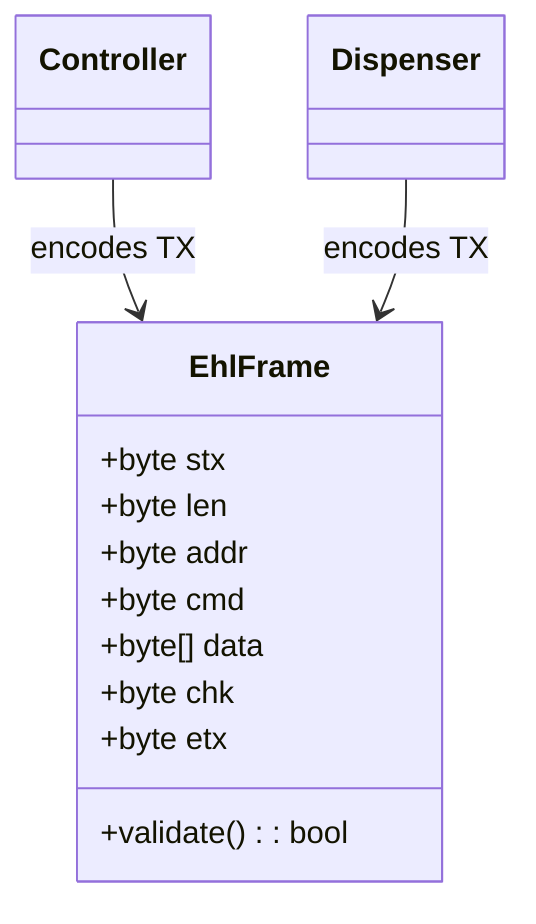
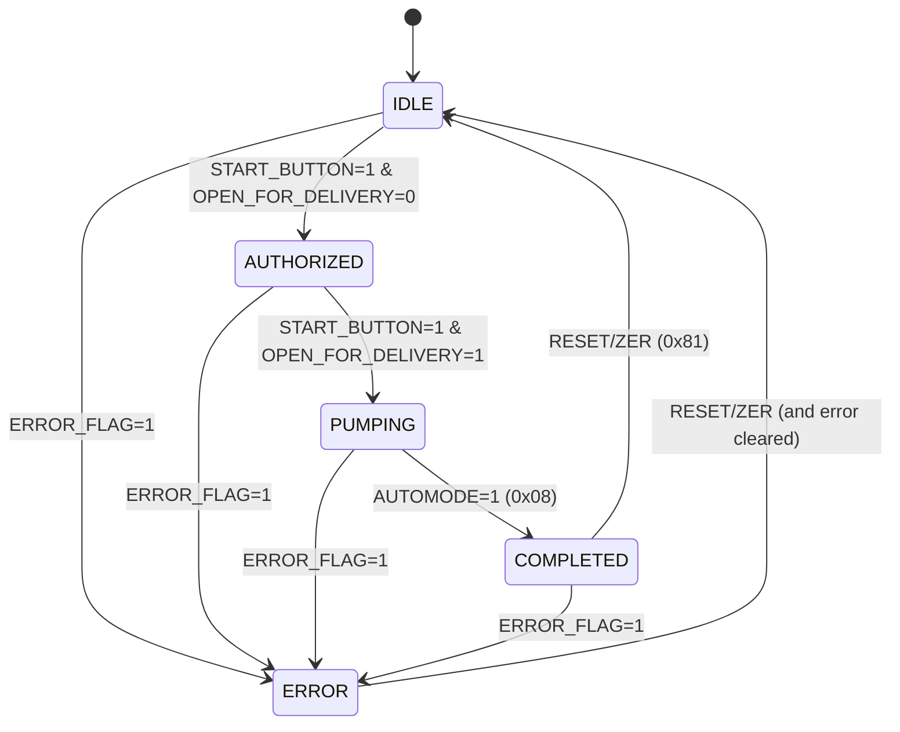
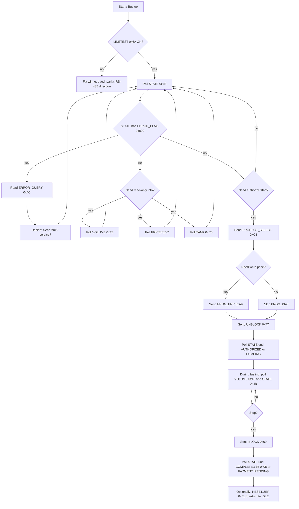
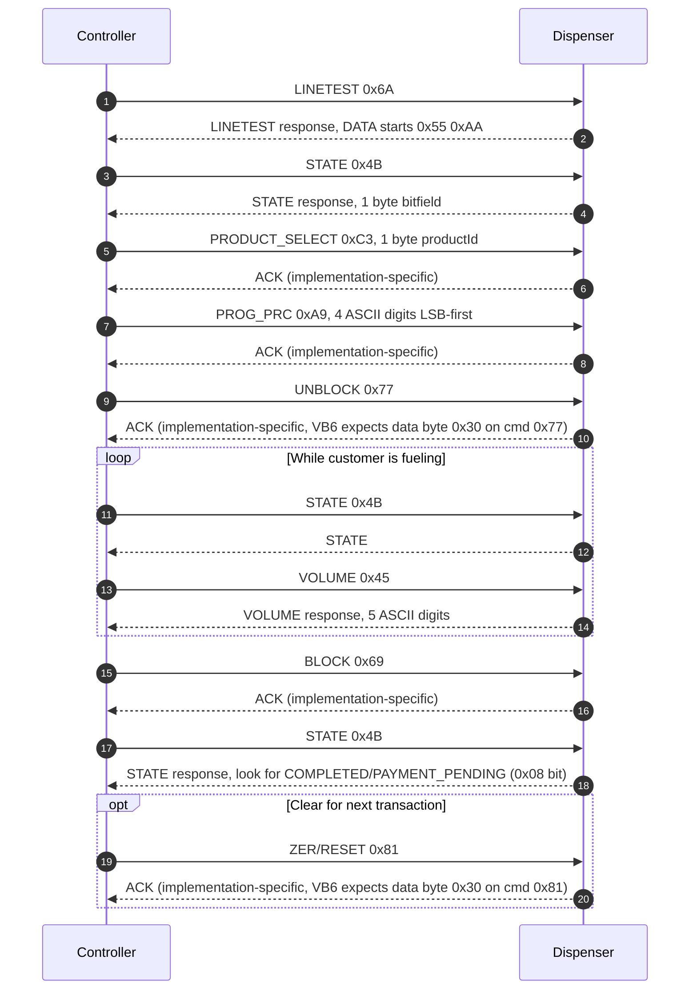
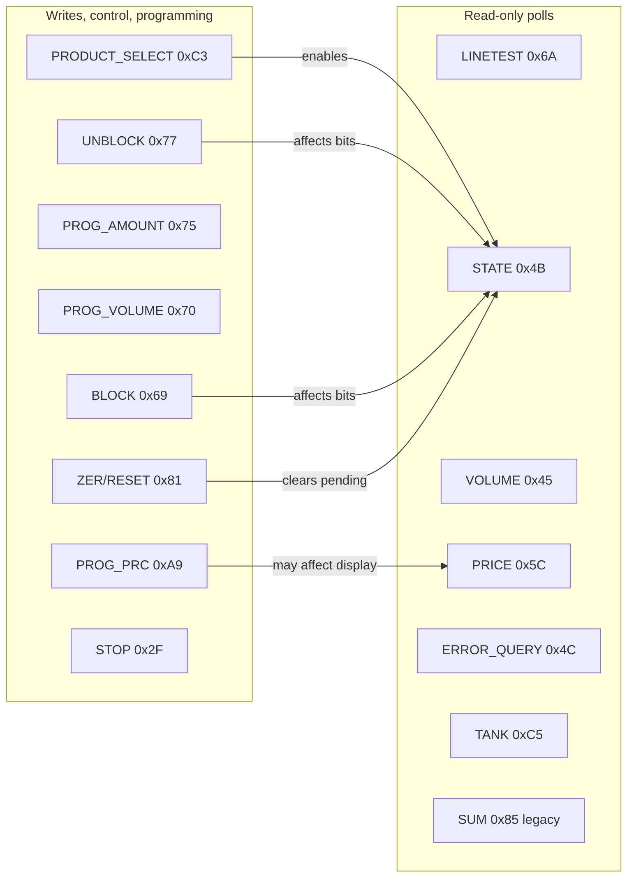

# EHL (Norges Gass variant) Command Guide — exhaustive (within this repo)

This document consolidates **all EHL command bytes referenced anywhere in this repository** (Kotlin production stack, Python field tools, and VB6 legacy sources) and explains what they do on the wire.

**Scope disclaimer (important):**
- This is an **exhaustive list for this repo**, not proof that the dispenser firmware has *no other commands*.
- Where behavior differs across implementations (VB6 vs Kotlin vs simulator), this doc calls that out explicitly.

---

## Protocol framing (RS-485)

### Variant used in this repo (“Norges Gass”)

- **Controller → Dispenser STX**: `0x10`
- **Dispenser → Controller STX**: `0x20`
- **ETX (both directions)**: `0x36`

Frame format:

```
STX   LEN   ADDR  CMD   DATA...   CHK   ETX
1     1     1     1     0..N      1     1
```

- **LEN**: total frame length in bytes (including STX..ETX)
- **CHK**: XOR of **every byte from STX through last DATA byte** (i.e. excluding CHK and ETX)

### UML (Mermaid) — frame structure



### Request/response rule of thumb

Most commands in this protocol behave like **polls**:
- Controller sends `CMD` (often with empty DATA)
- Dispenser replies with a frame where `CMD` is the same command and `DATA` contains the answer

Some commands behave like **control/programming**:
- Controller sends `CMD` plus a payload (digits, product select, preset)
- Dispenser replies with either:
  - `OK (0x1E)` with no payload (common in Kotlin simulator + some stacks), or
  - a command-specific ACK (VB6 legacy expects command response + payload `0x30` for some commands)

### VB6-style ACK semantics (seen in legacy code)

In VB6, “accepted” for some write/control commands is **not** “any valid response frame” and is **not** `OK (0x1E)`.

VB6 expects **the same command echoed back** with a 1-byte payload where the first byte is ASCII `"0"` (`0x30`):
- `PROG_AMOUNT (0x75)` accepted if response is `CMD=0x75` and first data byte is `0x30`
- `UNBLOCK (0x77)` accepted if response is `CMD=0x77` and first data byte is `0x30`
- `ZER/RESET (0x81)` accepted if response is `CMD=0x81` and first data byte is `0x30`

---

## Command set (exhaustive within this repo)

### Canonical list (Kotlin `EhlCommand`)

The Kotlin production protocol layer defines this set as the supported command universe:
- `OK (0x1E)`
- `ERROR (0x25)`
- `STOP (0x2F)`
- `VOLUME (0x45)`
- `STATE (0x4B)`
- `ERROR_QUERY (0x4C)`
- `PRICE (0x5C)`
- `BLOCK (0x69)`
- `LINETEST (0x6A)`
- `PROG_VOLUME (0x70)`
- `PROG_AMOUNT (0x75)`
- `UNBLOCK (0x77)`
- `ZER (0x81)` (reset)
- `PROG_PRC (0xA9)`
- `PRODUCT_SELECT (0xC3)`
- `TANK (0xC5)`

### Extra opcodes present in legacy VB6 sources (not in Kotlin enum)

These appear in `norgesgass_legacy` receive/transmit handlers:
- `SUM (0x85)` — “total sum and number of transactions since power on” (VB6 comment)
- `0x79` — appears in emulator-ish legacy code as a response; semantics unclear in this repo

### Simulator-only opcodes (non-canonical, conflicting)

`lpg-ehl-serialport-sim` defines:
- `CMD_PRICE = 0x4F` (79) and `CMD_RESET = 0x52` (82)

These **conflict** with the canonical repo definition where:
- `PRICE = 0x5C` (92)
- `ZER/RESET = 0x81` (129)

Treat `0x4F` / `0x52` as **simulator-local** unless you have hardware evidence otherwise.

---

## Command reference table

Legend:
- **R/W**: Read-style poll vs Write/control/programming
- **DATA (TX)**: payload controller sends
- **DATA (RX)**: payload dispenser returns (if any)

| CMD | Dec | Name | R/W | DATA (TX) | DATA (RX) | What it gives / changes |
|---:|---:|---|---|---|---|---|
| `0x1E` | 30 | OK | (ack) | none | typically none | Generic acknowledgement in several implementations |
| `0x25` | 37 | ERROR | R | usually none | impl-defined | Error “data”/notification in legacy; Kotlin calls it `ERROR` but primary query is `0x4C` |
| `0x2F` | 47 | STOP | W | none | varies | Stop operation (vendor semantics; not used in the modern fueling flow) |
| `0x45` | 69 | VOLUME | R | none | 5 ASCII digits (LSB-first) | Current dispensed volume; can be polled during fueling |
| `0x4B` | 75 | STATE | R | none | 1 byte bitfield | Pump state bits (open-for-delivery, start pressed, automode, error, …) |
| `0x4C` | 76 | ERROR_QUERY | R | none | 2 bytes (often ASCII digits) | Error code main/sub; maps to messages in VB6 legacy |
| `0x5C` | 92 | PRICE | R | none | 4 ASCII digits (LSB-first) | Read displayed unit price (XX.XX) |
| `0x69` | 105 | BLOCK | W | none | varies | Stops/blocks delivery; usually followed by state polling; VB6 may also issue RESET afterwards |
| `0x6A` | 106 | LINETEST | R | none | at least `0x55 0xAA` | Communication sanity check (“magic bytes”) |
| `0x70` | 112 | PROG_VOLUME | W | 6 ASCII digits (LSB-first) | ack varies | Program preset **volume** (liters * 100) |
| `0x75` | 117 | PROG_AMOUNT | W | 5 ASCII digits (LSB-first) | ack varies | Program preset **amount** (currency * 100) |
| `0x77` | 119 | UNBLOCK | W | none | ack varies | Enables delivery mode (“open for delivery” bit often flips) |
| `0x81` | 129 | ZER (RESET) | W | none | ack varies | Reset/clear calculator / transaction state (use carefully) |
| `0x85` | 133 | SUM (legacy) | R | unknown/none | unknown | “total sum / tx count since power on” (legacy-only in this repo) |
| `0xA9` | 169 | PROG_PRC | W | 4 ASCII digits (LSB-first) | ack varies | Program unit price; often requires `PRODUCT_SELECT` first |
| `0xC3` | 195 | PRODUCT_SELECT | W | 1 byte (product/grade) | ack varies | Select product/pistol/grade; gate for pricing/authorization flows |
| `0xC5` | 197 | TANK | R | none | ≥1 byte (bitfield) | Transaction flags: “unaccounted”, “power fault”, etc. |

---

## Payload formats (the gotcha: “LSB-first ASCII digits”)

Several payloads are **ASCII digits** sent in **reverse order** (least-significant digit first), because that is how the legacy VB6 system did it and the Kotlin/Python tooling mirrors that.

### VOLUME (`0x45`) — read current liters

- Response DATA: **5 bytes**, ASCII digits, LSB-first
- Meaning: decimal value is **centiliters** (liters * 100)

Example:
- 45.50 L → `"04550"` → bytes `['0','5','5','4','0']`

Implication:
- You can poll `VOLUME` while pumping to read metering progression.

### PRICE (`0x5C`) — read displayed unit price

- Response DATA: **4 bytes**, ASCII digits, LSB-first
- Meaning: **price*100** (øre/cents)

Example:
- 15.90 kr/L → `"1590"` → bytes `['0','9','5','1']`

### PROG_PRC (`0xA9`) — program price (write)

- TX DATA: **4 bytes**, ASCII digits, LSB-first for `"XX.XX"` without decimal point
- Common sequence in modern stack: `PRODUCT_SELECT → PROG_PRC → UNBLOCK`

### PROG_AMOUNT (`0x75`) — preset amount (write)

- TX DATA: **5 bytes**, ASCII digits, LSB-first (amount*100)

### PROG_VOLUME (`0x70`) — preset volume (write)

- TX DATA: **6 bytes**, ASCII digits, LSB-first (liters*100)

---

## STATE (`0x4B`) — how to read the pump state

The dispenser returns **1 byte**. This repo’s VB6 + Kotlin + Python agree on these key masks:

- `0x02` **OPEN_FOR_DELIVERY** (VB6: `DISP_openfordelivery`)
- `0x04` **START_BUTTON_PRESSED** (VB6: `DISP_startbuttonpressed`)
- `0x08` **AUTOMODE** (VB6: `disp_automode`, Kotlin maps this to `PAYMENT_PENDING` when idle)
- `0x80` **ERROR_FLAG**

### UML (Mermaid) — state machine (domain-level)

This is the repo’s *interpreted* state machine based on the `STATE` bitfield.

Important nuance: different layers in this repo label the `0x08` bit differently:
- Protocol mapper (`DispenserStateMapper`) treats `0x08` as **PAYMENT_PENDING** when the line is otherwise idle.
- Emulator/test docs often call `0x08` **STOPPED / transaction complete**.

In practice you can treat `0x08` as “**transaction complete / totals frozen / awaiting settlement**”.



### Practical caveat (what commands can’t do)

From field evidence in this repo: **UNBLOCK can flip OPEN_FOR_DELIVERY without physically releasing hardware**, because VB6 treated “real delivery started” as **START_BUTTON_PRESSED AND OPEN_FOR_DELIVERY**.

So: sending commands can authorize, but **some transitions require physical action** (nozzle lift, start button, interlocks).

---

## Command flowchart (what you can do over RS-485)



---

## UML sequence — typical “authorize → fuel → stop” loop



---

## Command impact map (read-only vs state-changing)



---

## What the pump can / cannot do “just by commands”

What you **can** do reliably (as evidenced by code + field tooling in this repo):
- **Health check the line**: `LINETEST (0x6A)`
- **Observe state transitions**: `STATE (0x4B)` bitfield
- **Observe metering while fueling**: `VOLUME (0x45)` polled periodically
- **Read the unit price the pump reports**: `PRICE (0x5C)`
- **Get fault reasons**: `ERROR_QUERY (0x4C)` (+ legacy mapping to messages)
- **Get a couple of transaction flags**: `TANK (0xC5)`

What you **can attempt**, but is **state/firmware dependent**:
- **Select grade/nozzle**: `PRODUCT_SELECT (0xC3)`
- **Program the unit price**: `PROG_PRC (0xA9)` (often requires `PRODUCT_SELECT` first)
- **Program presets**: `PROG_AMOUNT (0x75)` / `PROG_VOLUME (0x70)`
- **Authorize/enable delivery**: `UNBLOCK (0x77)`
- **Stop delivery**: `BLOCK (0x69)` (and sometimes `STOP (0x2F)`)
- **Clear/Reset**: `ZER (0x81)`

What you **cannot** do (or at least this repo shows no evidence you can):
- **Force the physical interlocks** (nozzle lift, start button, mechanical latch) purely by command.
- **Guarantee “hardware unlock”**: field evidence shows `UNBLOCK` can flip the “open for delivery” bit without the dispenser physically releasing.
- **Get rich telemetry** (temperature/pressure/flow rate/valve position/transaction IDs) — not surfaced by any known command in this repo’s protocol set.

---

## Per-command notes (repo-grounded)

### LINETEST (`0x6A`)
- **Purpose**: verify line-level communication
- **Expected RX**: payload starts with `0x55 0xAA` in “VB6 mode”
- **Use**: run before any control commands

### STATE (`0x4B`)
- **Purpose**: query state bitfield (the single most important poll)
- **Use**: after any control write, verify changes by polling `STATE` repeatedly

### VOLUME (`0x45`)
- **Purpose**: query metering
- **Answer to Q1**: **Yes** — you can query volume while fueling by polling `VOLUME` periodically.

### PRICE (`0x5C`)
- **Purpose**: read displayed unit price
- **Answer to Q2**: **Yes** — `PRICE` returns `XX.XX` encoded as 4 ASCII digits, LSB-first.

### PRODUCT_SELECT (`0xC3`) and PROG_PRC (`0xA9`)
- **Purpose**: select product/grade and program price
- **Answer to Q3**: **Yes, usually** — this repo’s modern flow uses `PRODUCT_SELECT → PROG_PRC` and notes many physical dispensers require price programming before they accept authorization.
- **Caveat**: hardware/firmware may enforce “only writable in certain states”. Always follow with `STATE` polling and watch for errors.

### UNBLOCK (`0x77`) / BLOCK (`0x69`) / ZER (`0x81`)
- **Purpose**: enable delivery, stop delivery, reset/clear state
- **Caveat**: UNBLOCK alone may not cause physical release; it may only set “open for delivery” bit.

### ERROR_QUERY (`0x4C`)
- **Purpose**: fetch error main/sub code
- **Additional info (Q5)**: yes — you can get structured error codes and map them to VB6’s message table (see `python-test/ehl_protocol.py` mapping and VB6 `logdisp_err`).

### TANK (`0xC5`)
- **Purpose**: fetch transaction flags
- **Additional info (Q5)**: yes — at least two flags are parsed in Kotlin:
  - “transaction unaccounted” (`0x08`)
  - “transaction finished due to power fault” (`0x01`)

### SUM (`0x85`) (legacy-only)
- **Purpose**: VB6 comment indicates “total sum / tx count since power on”
- **Status in modern stack**: not part of Kotlin `EhlCommand` and not used by current field scripts; treat as “known-but-not-integrated”.

---

## Answers to your specific questions

1) **Can we check the volume we are tanking while we are filling?**
- **Yes**: poll `VOLUME (0x45)` during fueling. The payload is 5 ASCII digits (LSB-first) representing liters*100.

2) **Can we read the price that the pump displays on its display?**
- **Yes**: poll `PRICE (0x5C)`. Payload is 4 ASCII digits (LSB-first) representing price*100.

3) **Can we write the price that the pump displays on its display?**
- **In this repo’s model: yes**, using `PRODUCT_SELECT (0xC3)` followed by `PROG_PRC (0xA9)`.
- **In real hardware: “yes, but state-gated”** is the safe assumption. Some dispensers require price programming before `UNBLOCK` is accepted; others may ignore/deny writes depending on mode.

4) **What do the other commands do and how do we exactly read the state?**
- **State**: read `STATE (0x4B)` and interpret bits `0x02/0x04/0x08/0x80`.
- **Other commands**:
  - `ERROR_QUERY (0x4C)`: error main/sub
  - `TANK (0xC5)`: transaction flags
  - `LINETEST (0x6A)`: comms check
  - `PROG_AMOUNT (0x75)` / `PROG_VOLUME (0x70)`: presets (write)
  - `BLOCK (0x69)` / `UNBLOCK (0x77)` / `ZER (0x81)`: control/reset
  - `STOP (0x2F)`: stop semantics (not central to current fueling flow)
  - `SUM (0x85)`: legacy-only, not integrated

5) **Is there any additional info we can get from those commands?**
- **Yes, but it’s limited**:
  - `ERROR_QUERY (0x4C)` gives structured fault codes.
  - `TANK (0xC5)` gives transaction flags (unaccounted, power fault).
  - `STATE (0x4B)` is your primary state telemetry.
  - `PRICE (0x5C)` and `VOLUME (0x45)` give the key “operator display” values.
  - Beyond that, this repo does **not** show evidence of richer telemetry (temperature, pressure, flow rate, totals per nozzle, etc.) via EHL—if the hardware supports it, it is not exercised here.

---

## Primary sources in this repo

- Kotlin protocol command enum: `lpg-ehl-core/src/main/kotlin/no/cloudberries/lpg/protocol/EhlCommands.kt`
- Framing + payload parsing: `lpg-ehl-core/src/main/kotlin/no/cloudberries/lpg/protocol/EhlCodec.kt`, `EhlPacket.kt`
- State mapping: `lpg-ehl-core/src/main/kotlin/no/cloudberries/lpg/protocol/DispenserStatus.kt`, `DispenserStateMapper.kt`
- Tank status parsing: `lpg-ehl-core/src/main/kotlin/no/cloudberries/lpg/protocol/TankStatusMapper.kt`
- Field tools: `python-test/ehl_protocol.py`, `python-test/FIELD_GUIDE.md`
- Legacy semantics & ACK expectations: `norgesgass_legacy/pumpekontroll.frm`
- Practical protocol notes: `docs/RS485_PUMP_COMMUNICATION_GUIDE.md`

