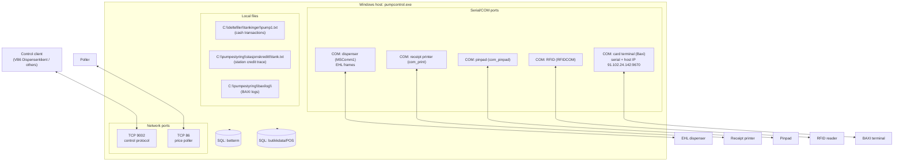
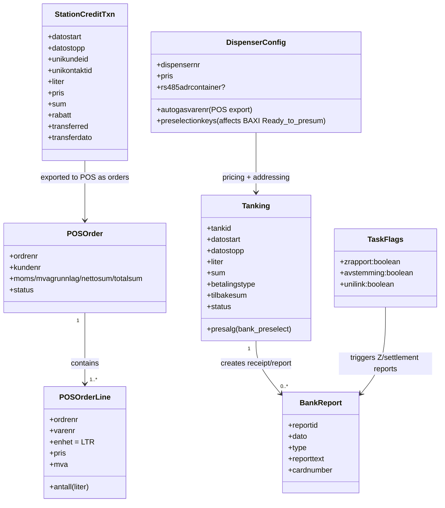
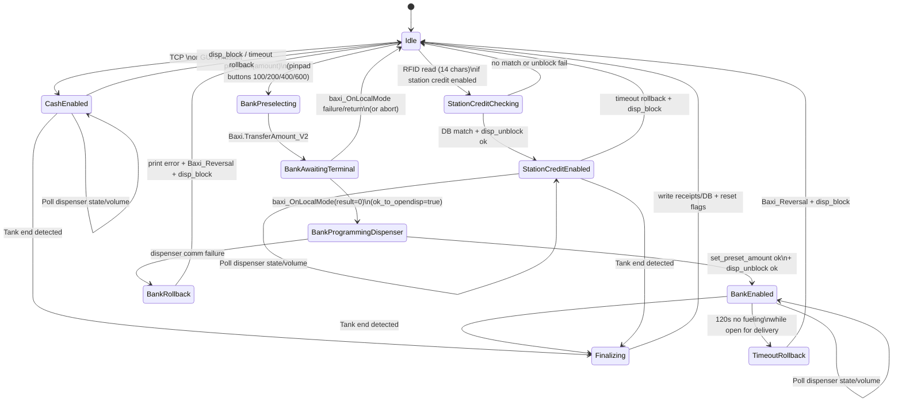
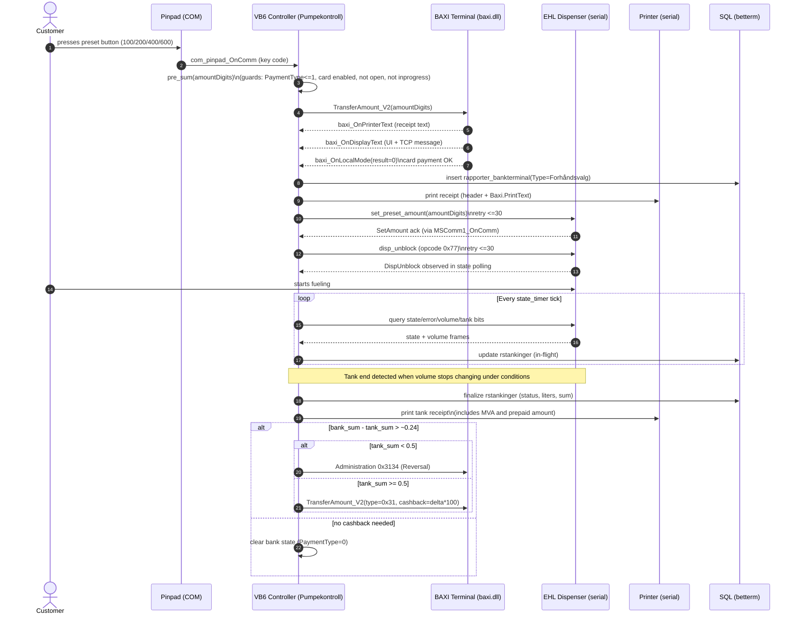
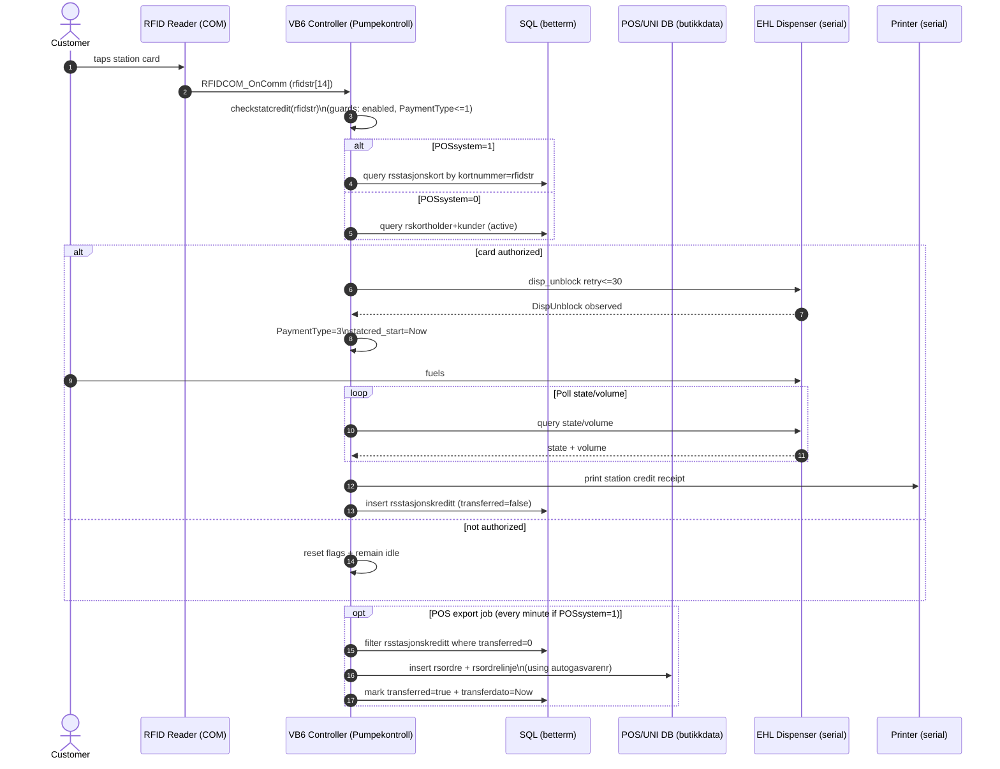
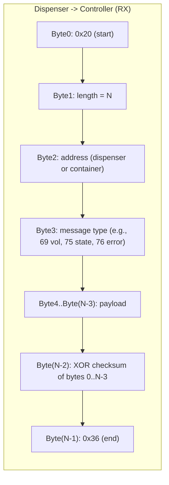

# VB6 Legacy — Architecture (Mermaid/UML)

This document is a visual companion to `docs/VB6_LEGACY_PUMPEKONTROLL_SPEC.md`.

It describes the VB6 `pumpcontrol` system as a set of **components**, **hardware/software boundaries**, and the **two core workflows** (bank preselect + station credit) using Mermaid diagrams.

---

## Big picture (components + boundaries)

```mermaid
flowchart LR
  %% External actors
  Operator[Operator / Technician]
  Customer[Customer]
  RemoteClient[Control client\n(VB6 Dispenserklient or other)]
  Poller[Status poller]

  %% Main app
  subgraph Host["Windows host running VB6 pumpcontrol.exe"]
    UI["Pumpekontroll (VB6 Form)\n- timers\n- event handlers\n- global state machine"]
    DispenserDrv["EHL Dispenser driver\n(MSComm1 + frame codec)"]
    PrinterDrv["Receipt printer driver\n(com_print + ESC/status)"]
    PinpadDrv["Pinpad driver\n(com_pinpad)"]
    RFIDDrv["RFID driver\n(RFIDCOM)"]
    BaxiDrv["BAXI terminal adapter\n(baxi.dll ActiveX)"]
    TcpServer["TCP server\nWinsock tcpserver:9002"]
    StatusPoller["Status poller\nWinsock status_poller:86"]
    Email["Email adapter\nMAPI (MSMAPI)"]
    DBAccess["ADO/Recordsets\n(DataEnvironment lpgnorge)"]
  end

  %% Local infrastructure
  subgraph SQL["SQL Server"]
    Betterm[(Controller DB\n\"betterm\")]
    POS[(POS/UNI DB\n\"butikkdata\")]
  end

  %% Hardware
  Dispenser["LPG dispenser\n(EHL over RS-485/serial)"]
  Container["Optional container controller\n(EHL addr +32)"]
  Printer["Receipt printer\n(serial)"]
  Pinpad["Local pinpad\n(4 buttons)"]
  RFID["RFID reader\n(serial)"]
  CardTerminal["Card terminal\n(BAXI)"]

  %% Connections
  Customer --> CardTerminal
  Customer --> Dispenser
  Operator --> Host
  RemoteClient <--> TcpServer
  Poller <--> StatusPoller

  UI <--> DispenserDrv
  UI <--> PrinterDrv
  UI <--> PinpadDrv
  UI <--> RFIDDrv
  UI <--> BaxiDrv
  UI <--> DBAccess
  UI <--> TcpServer
  UI <--> StatusPoller
  UI <--> Email

  DispenserDrv <--> Dispenser
  DispenserDrv <--> Container
  PrinterDrv <--> Printer
  PinpadDrv <--> Pinpad
  RFIDDrv <--> RFID
  BaxiDrv <--> CardTerminal

  DBAccess <--> Betterm
  DBAccess <--> POS
```

---

## Deployment view (ports + physical IO)



---

## Core domain objects (UML-ish class view)

This is not the full DB schema; it’s the conceptual model the VB6 code operates on.



---

## State machine (PaymentType + key guards)

This is the main controller “mode switch”. It’s global state in VB6, but should become an explicit state machine in a reimplementation.



---

## Sequence: Bank preselect -> fueling -> completion -> cashback/reversal decision

This diagram is the “money path” you likely care most about re-implementing correctly.



---

## Sequence: Station credit (RFID) -> fueling -> POS export



---

## Dispenser serial message framing (UML-ish)

This is the “codec” the VB6 app implements for EHL messages.



---

## Notes for re-implementation (what the diagrams imply)

- The VB6 app uses **event-driven callbacks** (serial receive, Winsock receive, BAXI events) plus **periodic polling** (timers). In a rewrite, keep the same concurrency model but make it explicit (actor/event loop).
- The “bank preselect” flow is a **distributed transaction** across BAXI + dispenser + DB; the rollback paths (`Baxi_Reversal` + `disp_block`) are critical and must be **idempotent**.
- The `PaymentType` global is effectively a coarse lock; model it as a **state machine** with explicit transitions and guards.


