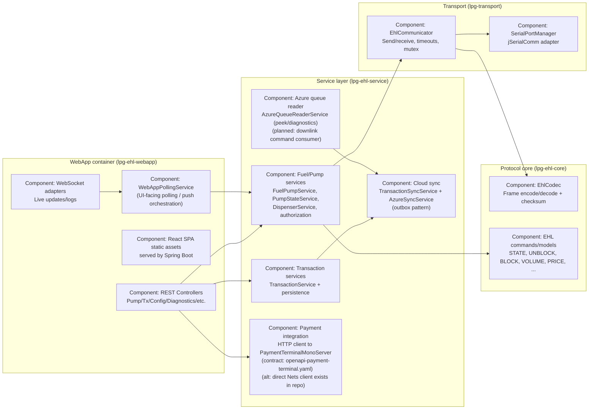
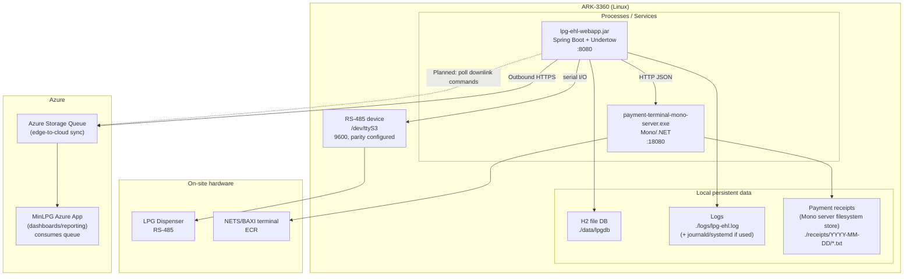
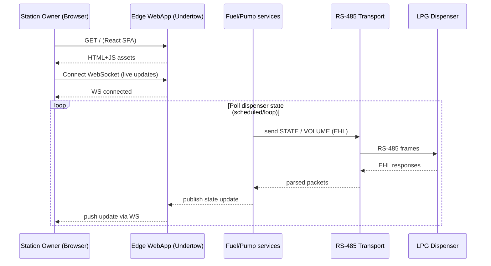
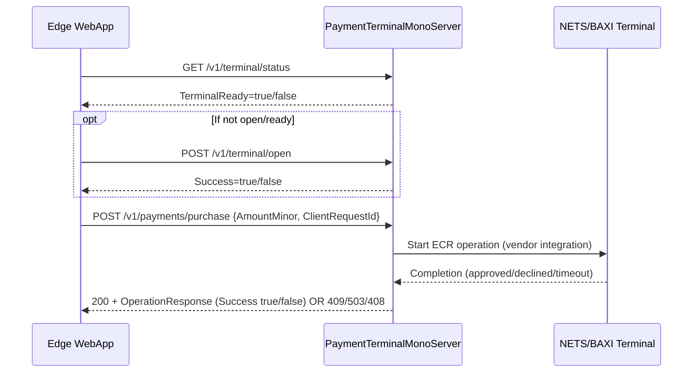
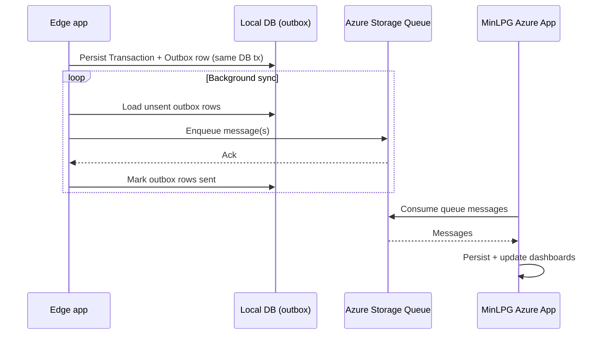

# LPG-EHL (ARK-3360) – Production Architecture (C4-style)

This document describes **how the solution works in production** on the **ARK-3360 (edge industrial PC)**, at multiple abstraction levels in a **C4 style** (Context → Container → Component → Deployment).

It is intentionally **simple**: one page you can hand to engineers + operations to align on runtime shape, boundaries, and data flows.

---

## Scope and assumptions

- **Primary deployment**: A single LPG station site, running on an **ARK-3360**.
- **UI**: A **React SPA** is bundled and served as static assets by the edge web application.
- **Pump control**: RS-485 to dispenser using the **EHL protocol** via the transport layer (`jSerialComm`).
- **Payment** (production target): Edge app calls a **local Payment Terminal Mono Server** (C#/.NET/Mono) over **HTTP REST**, which talks to the physical NETS/BAXI terminal via vendor integration.
- **Cloud**: Azure is used for **edge-to-cloud telemetry/transaction sync** and (eventually) **cloud-to-edge commands**, initiated by **polling from the edge**.

Where this repo contains concrete contracts/implementation, they are referenced inline:
- Payment Terminal Mono Server OpenAPI: `openapi-payment-terminal.yaml`
- Production webapp startup script on ARK: `scripts/start-webapp-production.sh`
- Azure queue reader/sync services: `lpg-ehl-service/src/main/kotlin/no/cloudberries/lpg/service/azure/*`

---

## C4 Level 1 — System Context (Production)

### Context diagram

```mermaid
flowchart LR
  %% People
  StationOwner[Person: Station Owner\nRole: MinLPG stasjonseier\nUses: Web UI for overview & operations]
  FieldTech[Person: Field Technician\nUses: Diagnostics / on-site maintenance]

  %% Edge system
  subgraph Site["LPG Station Site (Edge)"]
    Edge["System: LPG-EHL Edge (ARK-3360)\nKotlin/Spring Boot + React SPA\nControls pump, orchestrates payments,\npersists transactions, syncs with cloud"]
    Dispenser["System: LPG Dispenser\nWayne EHL over RS-485"]
    Terminal["System: NETS/BAXI Payment Terminal\nECR protocol (vendor)"]
    Mono["System: PaymentTerminalMonoServer\nC#/.NET/Mono HTTP wrapper\naround vendor integration"]
  end

  %% Cloud
  subgraph Azure["Azure (Cloud)"]
    CloudApp["System: MinLPG Azure App\nDashboards, reporting, fleet views"]
    Queue["Azure Storage Queue\nEdge↔Cloud messaging"]
  end

  %% Relationships
  StationOwner -->|HTTPS (LAN)\nWeb UI| Edge
  FieldTech -->|HTTPS/curl (LAN)\nDiagnostics & troubleshooting| Edge

  Edge -->|RS-485 serial\nEHL protocol| Dispenser

  Edge -->|HTTP REST (LAN/localhost)\nPayment operations| Mono
  Mono -->|Vendor integration\nECR/BAXI| Terminal

  Edge -->|Outbound sync (Internet)\nTransactions/telemetry| Queue
  CloudApp -->|Consumes for dashboards| Queue

  %% planned downlink
  Edge -.->|Planned: poll for downlink commands\n(e.g. config/alerts)| Queue
```

### Key properties (context)

- **Edge owns real-time control**: the ARK-3360 is the authority for dispenser state, blocking/unblocking, and transaction persistence.
- **Payment terminal is isolated** behind a **local HTTP API** (Mono server), to avoid embedding vendor DLL concerns in the JVM app.
- **Cloud is eventual-consistency**: intermittent connectivity is expected; the edge must continue operating offline and sync later.

---

## C4 Level 2 — Containers (What runs where)

### Containers on the ARK-3360

The edge can run as either:
- **WebApp mode** (`lpg-ehl-webapp`): UI + REST API + WebSockets for live updates.
- **Headless mode** (`lpg-ehl-app-headless`): background service (optionally with a debug API profile).

In production for “station owner UI”, the **WebApp container** is the key runtime.

```mermaid
flowchart TB
  subgraph Ark["ARK-3360 (Linux)"]
    Browser["Container: Browser\n(Station owner device)\nReact runs client-side"]
    WebApp["Container: LPG-EHL WebApp\nKotlin/Spring Boot\nEmbedded Undertow\nServes React SPA + REST + WebSocket\nPort: 8080 (default)"]

    DB["Container: Local DB\nH2 file DB (field default)\nor PostgreSQL (optional)\nStores transactions/outbox/etc."]

    Serial["Container: Serial Transport\nRS-485 adapter\nDevice: /dev/ttyS3 (ARK default)"]

    Mono["Container: PaymentTerminalMonoServer\nC#/.NET/Mono\nHTTP API\nPort: 18080 (production default)"]
  end

  subgraph Hardware["Local Hardware"]
    Dispenser["LPG Dispenser\nEHL protocol"]
    Terminal["NETS/BAXI Terminal\nECR"]
  end

  subgraph Cloud["Azure"]
    Queue["Azure Storage Queue"]
    AzureApp["MinLPG Azure App\nDashboards/Reporting"]
  end

  Browser <-->|HTTPS (LAN)\nGET / (SPA)\nWS / WebSocket| WebApp
  WebApp -->|JPA| DB
  WebApp -->|jSerialComm\nEHL frames| Serial
  Serial -->|RS-485| Dispenser

  WebApp -->|HTTP REST JSON\nPurchase/Refund/Admin| Mono
  Mono -->|Vendor integration\nECR/BAXI| Terminal

  WebApp -->|Outbound: enqueue/sync| Queue
  AzureApp -->|Consume messages| Queue
```

### Ingress/egress and ports (production defaults)

- **Web UI + API**: `8080/tcp` (see `scripts/start-webapp-production.sh`)
  - Serves React bundle from `lpg-ehl-webapp/src/main/resources/static/`
  - REST API (Spring MVC controllers)
  - WebSocket for live updates/log streaming (UI feature)
- **Serial**: `/dev/ttyS3`, \(9600\), parity typically configured (script defaults to `NONE`; real hardware may require `EVEN` depending on dispenser/adapter)
- **Payment Terminal Mono Server**: `18080/tcp` (see `openapi-payment-terminal.yaml`)
- **Azure**: outbound HTTPS to Azure Storage Queue endpoints (via SDK)

---

## C4 Level 3 — Components (Inside the edge application)

### Production-critical components (edge side)

The repo is modular; in production the runtime is assembled from these modules:
- `lpg-ehl-webapp`: Spring Boot entrypoint, Undertow, REST controllers, WebSocket adapters, serves React.
- `lpg-ehl-service`: business logic and persistence; orchestrates dispenser + payment + cloud sync.
- `lpg-transport`: RS-485 serial transport and communicator.
- `lpg-ehl-core`: EHL protocol encoding/decoding and protocol/domain models.



### Payment component contract (Mono server)

The edge calls the Mono server using the **Payment Terminal Mono Server API**:
- Health/readiness: `GET /health`, `GET /v1/terminal/status`
- Terminal lifecycle: `POST /v1/terminal/open`, `POST /v1/terminal/close`
- Financial ops: `POST /v1/payments/purchase`, `.../refund`, `.../cashback`
- Admin ops: `POST /v1/admin/avstemming`, `.../reversal`, `.../z-report`, etc.

**Operational constraints** (from the API contract and guide):
- **Single terminal, single in-flight operation** (server returns `409 terminal_busy` if busy).
- **Readiness gating**: financial ops require terminal open/ready (`503 terminal_not_ready` otherwise).
- **Idempotency** via `ClientRequestId` for safe retries.

---

## C4 Level 4 — Deployment (Production topology)

### Recommended production deployment on ARK-3360



### Production start knobs (what ops typically configures)

- **WebApp** (edge):
  - `--spring.profiles.active=field`
  - `--server.port=8080`
  - `--ehl.serial.port=/dev/ttyS3`
  - `--ehl.serial.baud-rate=9600`
  - `--ehl.serial.parity=NONE|EVEN|ODD`
- **Mono server** (payment gateway):
  - Base URL typically `http://127.0.0.1:18080` (configurable via its `server.json`)

---

## Key production flows (sequence)

### 1) “Station owner opens UI and sees live state”



### 2) “Payment operation via Mono server”



### 3) “Edge-to-cloud sync (uplink)”



---

## Production notes (what matters operationally)

- **Offline-first**:
  - Dispenser control and local persistence must work **without Azure**.
  - Cloud sync must be **retryable** and tolerant of intermittent connectivity.
- **Single terminal operation rule**:
  - The payment layer must enforce / handle `terminal_busy` and implement **idempotent retries** using `ClientRequestId`.
- **Serial comm is the critical real-time loop**:
  - RS-485 settings (especially **parity**) must match the physical dispenser configuration.
  - Timeouts/retries should be tuned to avoid UI lockups and log floods.
- **Security boundary**:
  - In production, treat the UI/API as a **LAN-only** service unless fronted by TLS + authentication at a reverse proxy.
  - Avoid exposing diagnostics/debug endpoints beyond the station network.

---

## Planned evolution: cloud-to-edge downlink

**Goal:** allow the Azure application to send messages down to stations (e.g. configuration, notices, operational actions).

**Recommended shape (fits “edge polls” requirement):**
- Cloud writes **commands** to a queue (or table).
- Edge runs a poller on an interval:
  - receives a message
  - validates (schema + auth)
  - applies (e.g. update pricing, show message, request reconciliation)
  - acknowledges (delete/complete message)

Today the repo contains an Azure queue reader (`AzureQueueReaderService`) used for **peeking/visibility**; a “receive + ack” downlink consumer would be added as a separate component.

