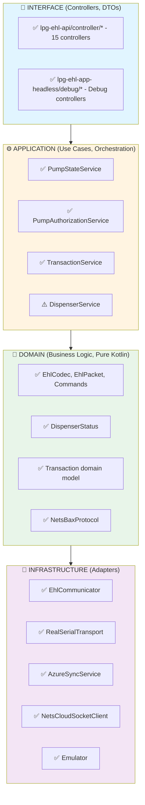

# LPG-EHL ARKITEKTUR-REVIEW

**Senior Kotlin/JVM Arkitekt Analyse**

- **Dato:** 7. februar 2026
- **Scope:** Full repository etter refaktorering
- **Fokus:** Spring Boot, Clean Architecture, Edge/Industrial readiness

## 1. ARKITEKTURKART

### 1.1 Maven-moduler og avhengigheter

```
lpg-ehl-parent
├── lpg-ehl-core          [LIBRARY] Pure domain - protokoll, codec, domain models
│   Dependencies: kotlin-stdlib, coroutines, slf4j (INGEN Spring!)
│
├── lpg-transport         [LIBRARY] Physical layer - RS-485 via jSerialComm
│   Dependencies: core, jSerialComm
│
├── lpg-ehl-emulator      [LIBRARY+EXEC] In-memory dispenser emulator
│   Dependencies: core, transport, Spring Boot Web
│
├── lpg-ehl-service       [LIBRARY] Application + Infrastructure
│   Dependencies: core, transport, emulator(opt), Spring Data JPA, Azure SDK
│   INNEHOLDER: Services, Repositories, Azure sync, Nets client, Health
│
├── lpg-ehl-api           [LIBRARY] REST Controllers + DTOs
│   Dependencies: service, core, emulator, Spring Web, Security, OpenAPI
│
├── lpg-ehl-webapp        [EXECUTABLE] Full web app med React SPA
│   Dependencies: api, service, core, transport, emulator
│   OUTPUT: release/lpg-ehl-webapp.jar (~60 MB)
│
├── lpg-ehl-app-headless  [EXECUTABLE] Background service + debug-api
│   Dependencies: api, service, core, transport, emulator
│   OUTPUT: release/lpg-ehl-headless.jar (~45 MB)
│
└── lpg-ehl-serialport-sim [EXECUTABLE] PLS Simulator
    OUTPUT: release/pls-sim.jar (~15 MB)
```
### 1.2 build_monolith.sh - Hva bygges?

| Steg | Beskrivelse |
|------|-------------|
| 1 | npm run build i lpg-web/ → React SPA |
| 2 | Kopier dist/* til webapp/static/ |
| 3 | mvn clean install (alle moduler) |
| 4 | Package webapp, headless, pls-sim |
| 5 | Kopier til release/ med standard navn |

**Artefakter:**
- lpg-ehl-webapp.jar - Full web app med React UI
- lpg-ehl-headless.jar - Headless med optional debug-api
- pls-sim.jar - Standalone PLS simulator

### 1.3 Profiler

| Profil | Beskrivelse | Aktiverer |
|--------|-------------|-----------|
| lab | H2 in-memory + emulator | Default for begge apps |
| field | Real serial port | PostgreSQL dialect, serial config |
| debug-api | Undertow webserver på 8090 | REST endpoints for curl |

**Viktig observasjon:** Headless har `web-application-type: none` som default. Debug-api overrider til servlet.

### 1.4 Adapters

| Adapter | Lokasjon | Type |
|---------|----------|------|
| Serial RS-485 | lpg-transport/SerialPortManager | jSerialComm |
| Serial Emulator | lpg-ehl-emulator/InMemorySerialPort | In-memory |
| Database | lpg-ehl-service/repositories | Spring Data JPA |
| Azure Queue | lpg-ehl-service/azure/AzureSyncService | Azure SDK |
| Nets Payment | lpg-ehl-service/integration/NetsCloudSocketClient | SSL/TLS Socket |

## 2. CLEAN ARCHITECTURE VURDERING

### 2.1 Lagstruktur - Faktisk vs Ideell



### 2.2 Gode eksempler (Clean Architecture)

**lpg-ehl-core - Ren domain layer:**
```
lpg-ehl-core/src/main/kotlin/no/cloudberries/lpg/protocol/
├── EhlCodec.kt              ✅ Pure encoding/decoding
├── EhlPacket.kt             ✅ Immutable data class
├── EhlCommand.kt            ✅ Enum med protocol constants
├── DispenserStatus.kt       ✅ Domain state machine
└── EhlProtocolConfig.kt     ✅ Configuration value object
```

**Controllers er "thin":**
```kotlin
// PumpController.kt - Delegerer til PumpStateService
@PostMapping("/pump/{address}/unblock")
fun unblockPump(@PathVariable address: Int): ResponseEntity<Map<String, Any>> {
    val result = pumpStateService.unblock(address)  // ✅ Ren delegering
    return result.fold(...)                          // ✅ Mapping av Result
}
```

### 2.3 Områder som bør ryddes

**1. PumpStateService er for stor (~940 linjer):**
- Inneholder state machine, EHL communication, authorization, settlement, price management
- Anbefaling: Split til PumpCommandService, PumpStateMachine, SettlementService

**2. Ingen global exception handler:**
```bash
$ grep -r "@RestControllerAdvice" --include="*.kt"
# Ingen treff!
```
- **Risiko:** Stack traces lekker til klient
- **Fix:** Legg til GlobalExceptionHandler.kt i lpg-ehl-api

**3. Transaction entity i to moduler:**
- `lpg-ehl-core/transaction/Transaction.kt` - Domain model
- `lpg-ehl-service/transaction/Transaction.kt` - JPA entity
- **Vurdering:** OK pattern (persistence ignorance), men krever mapping

## 3. EDGE/INDUSTRIAL READINESS

### 3.1 Robusthet

| Aspekt | Status | Detaljer |
|--------|--------|----------|
| Timeouts | ✅ | EhlCommunicator: 2000ms default, konfigurerbar |
| Retry | ⚠️ | Azure sync har retry, serial/Nets mangler |
| Backoff | ✅ | AzureSyncService: Exponential 2^n * 30s |
| Mutex | ✅ | EhlCommunicator bruker Kotlin Mutex |
| Fail-safe | ✅ | @ConditionalOnProperty for Azure |

**Mangler:**
- Ingen retry på serial timeouts
- Ingen circuit breaker for Nets payment
- Ingen idempotency-sjekk for transaksjoner

### 3.2 Offline-first

**Azure offline - UTMERKET:**
```kotlin
// AzureSyncService.kt - Outbox pattern
@Scheduled(fixedDelayString = "\${azure.sync.interval-seconds}000")
fun syncPendingItems() {
    val pendingItems = syncQueueRepository.findPendingItems(...)
    // Transaksjoner lagres lokalt FØRST, synces ETTERPÅ
}
```

**Nets offline - UTILSTREKKELIG:**
```kotlin
// NetsCloudSocketClient.kt
// IOException kastes uten retry - transaksjon blir PENDING forever
```

### 3.3 Ressursbruk

| Ressurs | Verdi | Vurdering |
|---------|-------|-----------|
| JVM Heap | 128-256 MB (headless) | ✅ Fornuftig for edge |
| Undertow threads | 1 IO, 4 workers | ✅ Optimalisert |
| Polling rate | 2000ms | ✅ Fornuftig |
| Serial timeout | 2000ms | ✅ Matcher polling |

**Potensielt problem:**
HeadlessPollingService og PumpStateService har BEGGE @Scheduled - men PumpStateService sine er kommentert ut. ✅ Korrekt håndtert.

### 3.4 Drift

**Systemd service - SOLID:**
```ini
# lpg-ehl.service
Restart=always
RestartSec=10
StandardOutput=journal
NoNewPrivileges=true
ProtectSystem=strict
```

**Health endpoints - BRA:**
- `/actuator/health` - Standard Spring Boot
- `SerialHealthIndicator` - Custom serial check
- `/api/debug/health` - Debug-api specific

**Mangler:**
- Prometheus metrics exporter
- Correlation ID for request tracing
- Log rotation i application.yaml (finnes i logback-spring.xml)

## 4. FELT-DEBUGGING API

### 4.1 Endpoint-struktur

| Prefix | Formål | Eksempler |
|--------|--------|-----------|
| `/api/v1/*` | Produksjons-API | `/api/v1/pump/1/status`, `/api/v1/transactions` |
| `/api/debug/*` | Debug-only | `/api/debug/state/1`, `/api/debug/linetest/1` |
| `/api/debug/serial/*` | Serial diagnostikk | `/api/debug/serial/ports`, `/api/debug/serial/scan-addresses` |
| `/actuator/*` | Spring Actuator | `/actuator/health`, `/actuator/info` |

**Vurdering:** ✅ Klar separasjon mellom prod og debug

### 4.2 Kvalitet på debug-endpoints

**Sterke sider:**
- Dokumentert i DEBUG_API_CURL_REFERENCE.md (350 linjer!)
- Konsistente JSON-responser
- Matcher Python-scripts fra Alejandro (00_list_ports, 02_scan_addresses)

**Mangler for "curl-runbook":**

| Endpoint | Status | Beskrivelse |
|----------|--------|-------------|
| `/api/debug/config` | ❌ Mangler | Vis gjeldende konfigurasjon |
| `/api/debug/last-error` | ❌ Mangler | Siste feil med stack trace |
| `/api/debug/events/recent` | ❌ Mangler | Siste N events |
| `/api/debug/sync/status` | ❌ Mangler | Azure sync status |
| `/api/debug/metrics` | ❌ Mangler | Basic metrics (poll count, errors) |

### 4.3 Sikring av debug-api

**Nåværende status - USIKRET:**
```kotlin
// SecurityConfig.kt
.authorizeHttpRequests { auth ->
    auth.anyRequest().permitAll()  // ⚠️ Alt er åpent!
}
```

**Anbefalte guardrails (velg minst 2):**

**1. IP whitelist:**
```kotlin
.authorizeHttpRequests { auth ->
    auth.requestMatchers("/api/debug/**").access(localNetworkOnly())
    auth.anyRequest().permitAll()
}
```

**2. Environment variable token:**
```yaml
ehl:
  debug:
    api-token: ${DEBUG_API_TOKEN:}  # Tom = disabled
```
'
**3. Localhost-only binding:**
```yaml
server:
  address: 127.0.0.1  # Kun lokal tilgang
```

**4. Startup warning + krav:**
```kotlin
if (env.activeProfiles.contains("debug-api") &&
    env.getProperty("DEBUG_API_TOKEN").isNullOrBlank()) {
    logger.error("❌ debug-api aktiv uten DEBUG_API_TOKEN!")
    // Vurder: exitProcess(1)
}
```

## 5. BUILD/DEPLOY

### 5.1 build_monolith.sh vurdering

**Styrker:**
- Fargekodet output
- Error handling med `set -e`
- Viser JAR-størrelser
- Dokumentert bruk

**Mangler for reproduserbarhet:**

| Forbedring | Status | Hvordan |
|------------|--------|---------|
| Git SHA i JAR | ❌ | git-commit-id-maven-plugin |
| Build timestamp | ❌ | application.yaml: build.time: @timestamp@ |
| Versjon i filnavn | ❌ | lpg-ehl-headless-1.2.3.jar |
| Checksum | ❌ | sha256sum release/*.jar > checksums.txt |
| /actuator/info | ⚠️ | Finnes, men mangler git info |

**Forslag til forbedret script:**
```bash
# Legg til etter JAR-kopiering:
GIT_SHA=$(git rev-parse --short HEAD)
BUILD_DATE=$(date -u +%Y%m%d-%H%M%S)

for jar in "$RELEASE_DIR"/*.jar; do
    sha256sum "$jar" >> "$RELEASE_DIR/checksums.txt"
done

echo "BUILD_GIT_SHA=$GIT_SHA" > "$RELEASE_DIR/build.properties"
echo "BUILD_DATE=$BUILD_DATE" >> "$RELEASE_DIR/build.properties"
```

### 5.2 Risiko med 3 artefakter på 50 stasjoner

| Risiko | Alvorlighet | Mitigering |
|--------|-------------|------------|
| Versjonsmismatch | Høy | Inkluder versjon i filnavn |
| Feil JAR på feil maskin | Medium | Ulike porter (8080 vs 8090) |
| Konfig-drift | Høy | Sentral konfig via env vars |
| Rollback | Medium | Behold N-1 versjon på maskin |

## 6. ACTION PLAN

### 6.1 Must-do before production (Priority Order)

| # | Hva | Hvorfor | Hvor | Effort |
|---|-----|---------|------|--------|
| 1 | Global exception handler | Forhindrer stack trace leak | lpg-ehl-api/GlobalExceptionHandler.kt | S |
| 2 | Debug-api sikkerhet | Produksjon backdoor | HeadlessApplication.kt, SecurityConfig.kt | S |
| 3 | Git SHA i /actuator/info | Sporbarhet | pom.xml + application.yaml | S |
| 4 | Retry for serial timeouts | RS-485 er ustabil | EhlCommunicator.kt | M |
| 5 | Health endpoint for dispenser | Monitorering | Utvid SerialHealthIndicator.kt | S |
| 6 | Graceful shutdown | Unngå corrupt transactions | HeadlessApplication.kt | S |
| 7 | Correlation ID | Debugging i produksjon | MDC filter | M |
| 8 | PostgreSQL dialect eksplisitt | Unngå H2 dialect i prod | application-field.yaml | S |
| 9 | Transaction idempotency | Unngå duplikater | Unique constraint i DB | S |
| 10 | Dokumenter rollback-prosedyre | Drift | docs/ROLLBACK.md | S |

### 6.2 Nice-to-have after production

| # | Hva | Hvorfor | Hvor | Effort |
|---|-----|---------|------|--------|
| 1 | Prometheus metrics | Overvåking | micrometer-registry-prometheus | S |
| 2 | Circuit breaker for Nets | Resilience | resilience4j | M |
| 3 | Split PumpStateService | Vedlikeholdbarhet | Ny pakkestruktur | M |
| 4 | OpenAPI contract tests | API parity | Spring Cloud Contract | M |
| 5 | Dead-letter queue for Azure | Observability | Ny tabell + status | S |
| 6 | /api/debug/config endpoint | Felt-debugging | DebugController.kt | S |
| 7 | /api/debug/last-error endpoint | Felt-debugging | In-memory ring buffer | S |
| 8 | Versjon i JAR-filnavn | Reproduserbarhet | build_monolith.sh | S |
| 9 | Testcontainers for PostgreSQL | CI/CD | Allerede i deps, bare bruk | M |
| 10 | Automatisk backup av H2 | Felt-data | @Scheduled dump | S |

## 7. SCORING

| Kategori | Score | Kommentar |
|----------|-------|-----------|
| A) Clean Architecture | 7/10 | God separasjon, men PumpStateService er for stor. Mangler global exception handler. |
| B) Edge Robustness | 7/10 | Mutex og outbox er bra. Mangler retry på serial, circuit breaker på Nets. |
| C) Operability | 7/10 | Solid systemd, god logging. Mangler correlation ID og Prometheus. |
| D) Debuggability | 8/10 | Utmerket curl-runbook dokumentasjon. Mangler config/error endpoints. |
| E) Security Readiness | 4/10 | Alt er permitAll. Debug-api er en produksjons-backdoor. |

**TOTAL: 6.6/10**

## 8. EXECUTIVE EVALUATION

### Mest imponerende:
- **Offline-first design** med outbox pattern for Azure sync er produksjonsklart
- **Debug-api konseptet** er gjennomtenkt med god dokumentasjon og klar separasjon
- **EHL protokoll-implementasjonen** i lpg-ehl-core er ren, testbar og VB6-kompatibel
- **Modulstruktur** følger clean architecture-prinsipper med tydelig dependency flow

### Mest risikabelt:
- **Security er helt deaktivert** - debug-api på port 8090 er åpen for alle
- **Ingen global exception handler** - stack traces kan lekke til klienter
- **Manglende retry for serial** - RS-485 på edge er notorisk ustabil

### Høyest ROI å fikse først:
1. **Global exception handler** (1 time) - forhindrer info-lekkasje
2. **DEBUG_API_TOKEN guard** (30 min) - kritisk sikkerhet
3. **Git SHA i actuator/info** (30 min) - sporbarhet er essensielt på 50 stasjoner
4. **Serial retry** (2-4 timer) - dramatisk bedre robusthet på edge

### Konklusjon:
Arkitekturen er solid og gjennomtenkt for edge-bruk. Med 4-8 timer arbeid på de kritiske punktene (exception handler, security, correlation ID) er dette klart for produksjonsdeploy på industrielle edge-maskiner. Det viktigste nå er å sikre debug-api før noen ved et uhell starter den i produksjon uten beskyttelse.